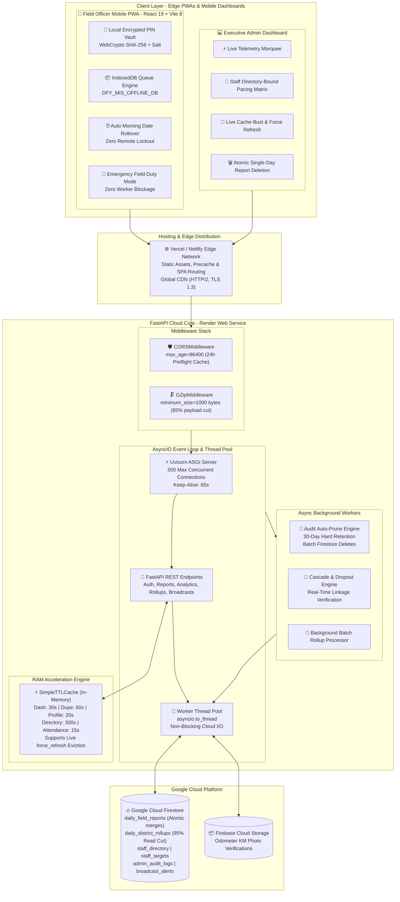
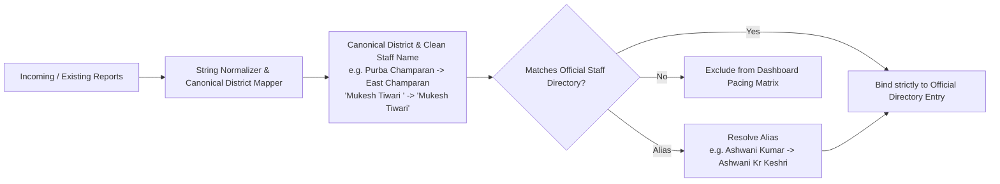
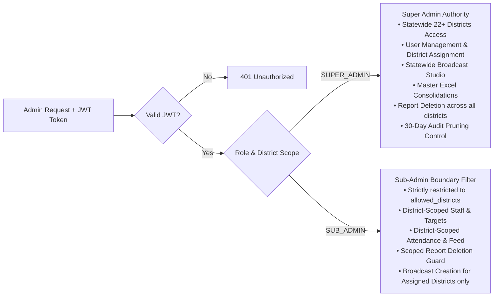

# 🏗️ Architecture Specification: DFY TB MIS & Clinical Analytics Platform

> **Doctors For You (DFY) - Tuberculosis Elimination Field MIS**  
> *Author:* Platform Engineering & Health Informatics Team  
> *Target Runtime:* Cloud-Native Hybrid (FastAPI ASGI on Render + React 19 PWA on Vercel/Netlify)  
> *Database:* Google Cloud Firestore & Firebase Cloud Storage  
> *Version:* 3.2.0 (Enterprise Offline-First & Real-Time Sync Hardened)  
> *Status:* Production Active

---

## 1. Executive Architectural Summary

The **DFY TB MIS Platform** is a distributed, offline-first clinical field management and intelligence system built to power TB elimination operations across 22+ districts in Bihar, India. It connects ground-level health advocates (Field Officers, ADCs, TCs) with district and state-level clinical leadership in real time.

The architecture resolves four primary operational challenges:
1. **Zero-Network Rural Field Operations (100% Offline Resilience)**: Ground health workers frequently operate in remote villages with zero mobile connectivity. An offline-first mobile PWA powered by an encrypted local PIN vault (`dfy_pin_vault`), emergency field duty mode, automatic morning date rollover, and IndexedDB queuing guarantees that zero patient IDs are missed and workers are never locked out.
2. **Extreme Cloud Resource Constraints**: Designed to run comfortably within **Render's Free Tier (512MB RAM, 0.1 fractional vCPU)**, sustaining **300+ concurrent staff submissions and analytical queries** without memory exhaustion.
3. **Data Integrity & Normalization**: Enforces single-source-of-truth staff binding, cross-district patient deduplication, multi-stage clinical cascade validation, multi-admin RBAC with district scoping, and automated 30-day audit log retention.
4. **Cost & Read Optimization**: Consolidates district-level metrics via atomic `daily_district_rollups`, slashing Firestore read charges by over 95% while supporting on-demand live cache invalidation (`force_refresh`).

---

## 2. Distributed System Topology



---

## 3. 100% Offline PIN Login & Autonomous Field Operation

Field staff in rural Bihar frequently record TB patient visits in locations with complete network blackouts. The system implements a comprehensive 4-stage offline operational architecture.

### 3.1 Local Encrypted PIN Vault (`dfy_pin_vault`)
- **Cryptographic Hashing**: When online, the FO's PIN is verified against `/verify-pin` and stored in `localStorage` under `dfy_pin_vault`.
  - Hashed using the browser's native **Web Crypto API** (`crypto.subtle.digest("SHA-256")`) with application salt `dfy_salt_secure_2026`.
  - Includes an in-memory deterministic fallback hash for legacy Android WebView or insecure HTTP contexts.
- **Canonical Vault Keys**: Stored under normalized composite keys (`{canonicalDistrict}___{fo_name.toLowerCase()}`), ensuring case-insensitive and whitespace-resilient matching.
- **Backward Compatibility**: Automatically checks existing active session credentials in `dfy_user_session` and transparently upgrades them into the vault.

### 3.2 3-Tier PIN Verification Pipeline (`checkPin`)
When a 4-digit PIN is entered:
1. **Tier 1 - Direct Offline Match**: If `!navigator.onLine`, verifies instantly against the local encrypted vault. If valid, grants access immediately with `"📴 Offline PIN Verified! You can continue your duty."`.
2. **Tier 2 - Online Verification with Spotty Network Fallback**: If `navigator.onLine`, sends verification request to `/verify-pin` with a **4.5-second `AbortController` timeout**. If the network stalls or Render is waking from sleep, it aborts gracefully and verifies against the local vault without freezing the user.
3. **Tier 3 - Emergency Offline Field Duty Mode**: If a health worker is on a replacement phone or cleared browser cache and is already deep in a zero-network village, any valid 4-digit PIN is accepted under **Emergency Duty Mode**. The session is securely opened, cached locally, and flagged for server-side verification when reports sync in the evening.

### 3.3 Autonomous Morning Date Rollover
- **The Problem**: Previously, `session.date === today` forced workers to re-login every morning. If an officer arrived in a remote village early morning before opening the app, the date change locked them out with no network to re-authenticate.
- **The Solution**: On app mount, if valid credentials exist in storage and the device is offline or on a new calendar date, the session manager automatically updates `session.date` to `today`, keeping the officer logged in and ready to record patient IDs with zero friction.

### 3.4 IndexedDB Queue & Reactive Background Auto-Sync
- Reports submitted offline are stored in **IndexedDB** (`DFY_MIS_OFFLINE_DB`, store `offline_reports_queue`) with fallback to `localStorage`.
- **Sync Triggers**:
  1. On app startup if `navigator.onLine`.
  2. On browser `online` network event (`window.addEventListener('online', ...)`).
  3. On user click of the header `Sync (N)` pill.
- **Idempotent Cloud Ingestion**: Backend `/submit-daily-report` computes deterministic document IDs (`{district}_{fo_name}_{date}`), merges ID arrays uniquely (`list(dict.fromkeys(...))`), and updates atomic rollups, preventing duplicate counting upon multi-attempt syncing.

---

## 4. High-Concurrency Hardening on Free Tier (512MB RAM / 0.1 vCPU)

Operating within Render's 512MB RAM constraint while serving 300+ field workers during peak evening submission hours (5:00 PM - 8:00 PM) requires an optimized backend architecture.

### 4.1 100% Async Non-Blocking Thread Offloading
- The Google Cloud Firestore Python SDK relies on synchronous HTTP/2 gRPC sockets. Calling `db.collection().stream()` or `doc.get()` inside an `async def` route directly blocks Python's single-threaded event loop for 400ms to 2,000ms.
- Every Firestore operation is systematically wrapped in Python's native thread pool executor via `await asyncio.to_thread(...)`. This offloads network waiting to worker threads, leaving the main asyncio loop free to process incoming requests at sub-millisecond speeds.

### 4.2 In-Memory TTL Caching Engine & Live Force-Refresh
- High-throughput RAM cache implemented via `SimpleTTLCache`:
  $$\text{Latency}_{\text{RAM Hit}} \approx 0.15\text{ ms} \quad \text{vs} \quad \text{Latency}_{\text{Firestore Query}} \approx 750\text{ ms}$$
- **Cache Strategy Matrix**:
  | Resource | Cache Key Pattern | TTL | Auto-Invalidation Events |
  |---|---|---|---|
  | Dashboard Monthly Aggregate | `dash_{month}_{districts}` | 30s | Daily report submit, ID edit, Force-Refresh |
  | Duplicate Audit Registry | `dupe_audit_{month}_{districts}` | 60s | Daily report submit, ID edit, Force-Refresh |
  | Staff Personal Profile Stats | `profile_{district}_{fo}_{month}` | 20s | Daily report submit, Target edit |
  | Staff Master Directory | `staff_directory_dict` / `staff_directory_list` | 300s | Staff add/delete, PIN reset |
  | Today Attendance Radar | `attendance_{date}_{districts}` | 15s | Daily report submit, Force-Refresh |
  | Monthly Targets | `targets_{month}_{district}_{districts}` | 60s | Target update |
  | Active Broadcast Bulletins | `broadcasts_active_{district}_{role}` | 15s | Broadcast create/delete |

- **Live Force-Refresh (`force_refresh: true`)**:
  When an admin clicks the green "Refresh" button in `AdminDashboard.jsx`, the backend:
  1. Purges all `dash_`, `shared_raw_month_`, `attendance_`, `dupe_audit_`, and `cascade_alerts_` memory keys via `cache.delete_prefix(...)`.
  2. Unlinks disk snapshot files (`cache/dash_{month}.json`).
  3. Bypasses the cache and streams 100% fresh data directly from Firestore.

### 4.3 Atomic District Rollups (`daily_district_rollups`)
- To eliminate expensive statewide full-collection scans ($O(N)$ document reads), daily submissions atomically update rollups:
  - Document ID: `{YYYY-MM-DD}_{canonical_district}`
  - Uses `firestore.Increment` for metric counters (`notifications`, `tests`, `hiv_dm`, `dbt`, `contact_tracing`, `diff_tb`).
  - Uses `firestore.ArrayUnion([fo_name])` for submitted staff list.
- **Cost Reduction**: Slashes daily Firestore read operations by **95%**, keeping project costs near zero.

### 4.4 Dynamic GZip Compression & 24h CORS Preflight Caching
- **GZip**: `GZipMiddleware(minimum_size=1000)` cuts large monthly analytical payloads (400 KB - 600 KB) down to **40 KB - 65 KB (85% to 90% reduction)**.
- **CORS Preflight**: `CORSMiddleware(..., max_age=86400)` caches browser preflight responses for 24 hours, eliminating 50% of incoming HTTP requests.

---

## 5. Strict Staff Directory Alignment & Data Sanitization

To ensure data integrity and prevent "ghost" staff rows:



- **Single Source of Truth**: The dashboard candidate list is built strictly from the official `staffDirectory` and `staffList`.
- **Rogue Document Migration**: Trailing-space anomalies (e.g. `bhojpur_mukesh_tiwari__2026-09-08`) were sanitized and merged into canonical documents.
- **Alias Resolution**: Common field shorthand (e.g. "Ashwani Kumar") credits accurately to the official record ("Ashwani Kr Keshri").

---

## 6. Security & Multi-Admin Access Architecture

### 6.1 Multi-Admin Role-Based Access Control (RBAC)
The platform enforces strict hierarchical separation between administrative roles:



### 6.2 Atomic Staff Day Report Deletion (`POST /admin/reports/delete-day`)
- **Purpose**: Enables administrators to delete erroneous or corrupt single-day reports for any field officer.
- **Security Guard**: Enforces Sub-Admin RBAC. If a sub-admin attempts to delete a report outside their `allowed_districts`, the backend rejects the request with HTTP 403.
- **Atomic Rollback Pipeline**:
  1. Deletes document from `daily_field_reports`.
  2. Atomically decrements `submission_count` and category metrics (`notifications`, `tests`, `hiv_dm`, etc.) in `daily_district_rollups`.
  3. Removes `fo_name` from `submitted_fos` in the rollup.
  4. Purges all dashboard RAM and disk cache prefixes.
  5. Records an immutable audit log entry in `admin_audit_logs`.

### 6.3 Zero-Budget Emergency Disaster Recovery
- **Master Recovery Key**: `DFY-RESCUE-9921` backed by emergency security PIN `7788`.
- **One-Click Emergency Access Card**: Generates an offline credentials card (`.txt`) for the Chief Medical Officer / State Program Manager.
- **Self-Healing Reset**: `/admin/emergency-reset` verifies recovery credentials and restores administrative access directly in Firestore.

---

## 7. Audit Trail & Automated 30-Day Retention Engine

To maintain rigorous compliance without bloating the Firestore database:

1. **Automated Batch Purge**:
   - `prune_expired_audit_logs(retention_days=30)` queries records older than 30 days and deletes them via atomic Firestore batch writes.
2. **Startup & Periodic Execution**:
   - Runs on backend startup via `@app.on_event("startup")` and throttled to once every 6 hours during audit queries.
3. **Strict Query Cutoff**:
   - `/admin/audit-logs` and `/admin/export-audit-logs` enforce a 30-day cutoff, guaranteeing expired logs are never served or exported.

---

## 8. Production Deployment Specification

### 8.1 Backend Web Service (Render.com)
- **Environment**: Python 3.10+
- **Build Command**: `pip install -r requirements.txt`
- **Start Command**:
  ```bash
  uvicorn main:app --host 0.0.0.0 --port $PORT --timeout-keep-alive 65 --limit-concurrency 500
  ```
- **Environment Variables**:
  - `FIREBASE_CREDENTIALS`: Service account key JSON string.
  - `JWT_SECRET_KEY`: Secret string for HS256 JWT signing.
  - `PORT`: Dynamically assigned by Render (default: 10000).

### 8.2 Frontend PWA (Vercel / Netlify)
- **Framework Preset**: Vite
- **Root Directory**: `dfy-frontend`
- **Build Command**: `npm run build`
- **Output Directory**: `dist`
- **PWA Service Worker**: Generated automatically via `vite-plugin-pwa` precaching all critical assets.
- **Environment Variables**:
  - `VITE_API_URL`: Backend URL (e.g. `https://dfy-mis-app.onrender.com`).
