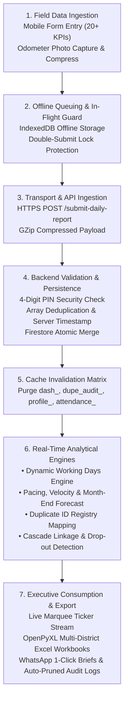

# 🔄 Data Processing & Feature Specification: DFY TB MIS

> **Doctors For You (DFY) - Tuberculosis Elimination Field MIS**  
> *Author:* Health Informatics & Analytics Engineering  
> *Platform:* FastAPI Backend + Google Cloud Firestore + React 19 Engine  
> *Coverage:* 22+ Districts in Bihar, India  
> *Version:* 2.8.3 (Stealth 10 AM Cutoff, Staff Attendance Dual-Sheet, Consonant Defense & Documents Cohort Partitioning)  
> *Status:* Production Active

---

## 1. End-to-End Data Processing Pipeline

The platform ingests clinical records from mobile field workers, validates them against programmatic business logic, computes real-time analytical indicators, and disseminates actionable intelligence to program managers.



---

## 2. Step-by-Step Data Processing Lifecycle

### Step 1: Field Data Ingestion & Mobile Entry
- Field health advocates record daily patient interactions via the mobile PWA (`App.jsx`).
- **Input Sanitization & Normalization**:
  - Patient IDs (Nikshay registration numbers) entered as comma-separated or space-separated strings are automatically stripped of whitespace, normalized to uppercase, and filtered for minimum length ($\ge 5$ characters).
  - Odometer morning and evening photos are converted to base64 or stored in Firebase Cloud Storage, recording travel distance.

### Step 2: Offline Resilience & Sync Engine
- **IndexedDB Store (`dfy_offline_reports`)**:
  - When `navigator.onLine === false` or if an HTTP socket fails, the submission payload is saved to the local device's IndexedDB queue.
  - The officer receives an immediate confirmation: `📴 Internet nahi hai. Report phone me safe save ho gayi hai!`.
  - When network restores (`window.addEventListener('online')`), the queue automatically dispatches pending reports in chronological order with zero data loss.

### Step 3: In-Flight Validation & Concurrency Protection
- **Double-Submit Prevention**: The `submitReport()` handler checks `if (isSubmitting) return;`. This eliminates accidental duplicate requests from double-tapping under slow 3G/4G connections.
- **PIN Verification**: Verifies the officer's 4-digit PIN against `staff_directory` using an in-memory cached lookup (`pin_{doc_id}`).

### Step 4: Backend Ingestion & Document Mutation
- **Route**: `POST /submit-daily-report`
- **Document Key Formulation**:
  $$\\text{Doc ID} = \\text{lowercase}(\\text{sanitize}(\\text{working\\_place} + \"\\_\" + \\text{fo\\_name} + \"\\_\" + \\text{date}))$$
- **Array Deduplication & Merge Logic**:
  If an officer submits multiple updates for the same day (e.g. morning tests + evening notifications):
  ```python
  # Deduplicate patient IDs without losing prior entries
  combined = d.get(field_key, []) + new_ids
  payload[field_key] = list(dict.fromkeys(combined))
  ```
- **Remark Chaining**: Multiple operational remarks throughout the day are chained with divider bars: `\"Morning clinic visit | Evening contact tracing in block X\"`.
- **Server Timestamp**: Stamped with `firestore.SERVER_TIMESTAMP` for auditable submission chronology.

### Step 5: In-Memory TTL Cache Invalidation
Upon successful persistence, the backend immediately executes prefix-based cache invalidation:
```python
cache.delete(f"status_{doc_id}")
cache.delete_prefix("dash_")
cache.delete_prefix("dupe_audit_")
cache.delete_prefix("attendance_")
cache.delete_prefix("profile_")
cache.delete_prefix("cascade_alerts_")
```
This guarantees that subsequent dashboard queries pull fresh data while maintaining sub-millisecond RAM response speeds for concurrent reads.

---

## 3. Real-Time Analytical & Calculation Engines

### 3.1 Dynamic Working Days & Calendar Modeling Engine
To compute accurate run-rates, the platform dynamically calculates real working days for any selected month:

1. **Total Calendar Days ($D_{\\text{total}}$)**:
   $$D_{\\text{total}} = \\text{Days in the month (28, 29, 30, or 31)}$$
2. **Sunday Elimination ($S_{\\text{count}}$)**:
   Scans day 1 to month-end and identifies all Sundays ($S_{\\text{count}} \\in [4, 5]$).
3. **Declared Government Holidays ($H_{\\text{declared}}$)**:
   Admin-adjustable counter (default: 1 holiday, adjustable 0–10) reflecting state/festival holidays (Chhath, Diwali, Eid, etc.).
4. **Formulas**:
   $$W_{\\text{total}} = D_{\\text{total}} - S_{\\text{count}} - H_{\\text{declared}}$$
   $$W_{\\text{elapsed}} = \\text{Working days elapsed up to current date (excluding Sundays & holidays)}$$
   $$W_{\\text{remaining}} = \\max(0, W_{\\text{total}} - W_{\\text{elapsed}})$$

---

### 3.2 Staff Target Pacing, Velocity & Month-End Forecasting Engine

For every field staff member (ADC, TC, FO):

| Metric | Formula | Clinical Meaning |
|---|---|---|
| **Expected Benchmark to Date** | $$T_{\\text{expected}} = \\text{round}\\left(\\frac{T}{W_{\\text{total}}} \\times W_{\\text{elapsed}}\\right)$$ | Pro-rated target an officer should have achieved by today |
| **Pacing Health Ratio (%)** | $$\\text{Pacing } \\% = \\text{round}\\left(\\frac{A}{T_{\\text{expected}}} \\times 100\\%\\right)$$ | How fast the officer is running relative to elapsed time |
| **Current Daily Velocity** | $$V_{\\text{actual}} = \\frac{A}{\\max(1, W_{\\text{elapsed}})}$$ | Average notifications logged per working day |
| **Required Recovery Velocity** | $$V_{\\text{recovery}} = \\frac{\\max(0, T - A)}{\\max(1, W_{\\text{remaining}})}$$ | Daily notifications required for remaining working days to hit target |
| **Projected Month-End Finish** | $$\\text{Projected} = \\text{round}(A + (V_{\\text{actual}} \\times W_{\\text{remaining}}))$$ | Forecasted total notifications at month-end based on current pace |
| **Forecast Gap (Surplus/Deficit)** | $$\\text{Forecast Gap} = \\text{Projected} - T$$ | Over-achievement (+) or shortfall (-) in notifications |

#### Traffic Light Classification:
- 🟢 **Ahead / On Track**: $\\text{Pacing } \\% \\ge 90\\%$
- 🟡 **Watchlist / Needs Push**: $70\\% \\le \\text{Pacing } \\% < 90\\%$
- 🔴 **Critical Lag / At Risk**: $\\text{Pacing } \\% < 70\\%$

---

### 3.3 Cross-Officer Patient ID Duplicate Detection Engine
- **Purpose**: Prevents duplicate counting of the same TB patient by different field officers or across multiple days.
- **Algorithm**:
  1. The backend builds an inverted index `id_registry[patient_id] = [{fo_name, district, date, category}, ...]`.
  2. Identifies all IDs where `len(occurrences) > 1`.
  3. Classifies each repeated ID:
     - **Same-Category Duplicates**: Same patient ID reported twice in the *same* programmatic category (e.g. two separate notifications for the same patient). Flagged as **Critical Data Anomaly**.
     - **Cross-Category Linkages**: Same patient ID reported across *different* categories (e.g. Notification on Day 2, then Sample Tested on Day 5, then DBT on Day 10). Recognized as **Valid Cascade Progression**.

---

### 3.4 Clinical Cascade & Drop-out Detection Engine
- Cross-references each patient ID in `notification_ids` against downstream service arrays:
  $$\\text{Notification ID} \\xrightarrow{\\text{link check}} \\{\\text{HIV/DM}, \\text{DBT}, \\text{Outcome}, \\text{TPT}\\}$$
- **Dropout Classifications**:
  - **CRITICAL DROPOUT**: Notification active $>14$ days with neither HIV/DM screening nor DBT account linking.
  - **PARTIAL LINKAGE**: HIV/DM screened, but bank account DBT pending (risk of patient missing government nutritional support).
  - **CASCADE COMPLETE**: Fully linked with diagnostic, financial, and treatment outcome confirmation.

---

### 3.5 Real-Time Attendance Radar & Leave Resolution Engine
- **Three-Tier Roster Resolution**:
  Compares active staff roster from `staff_directory` against today's submitted reports (`daily_field_reports`) and leave records (`daily_staff_leaves`):
  1. **Submitted**: Staff who submitted $\ge 1$ clinical report or odometer transit for the queried date.
  2. **On Leave**: Staff with an active record in `daily_staff_leaves` (`{date}_{district}_{fo}`).
     - Classified by reason: `Medical`, `Casual`, `Official Work`, `Personal`, `Uninformed`.
     - Excluded from "Missing Officers" tally and segregated into a dedicated purple "On Leave" tab.
  3. **Missing**: Unsubmitted staff who are neither submitted nor on leave.
- **WhatsApp Digest Auto-Exclusion**:
  $$\text{Missing Roster}_{\text{WhatsApp}} = \text{Staff}_{\text{Active}} \setminus (\text{Submitted} \cup \text{On Leave})$$
  Staff on leave are extracted into a dedicated `🌴 Chhuti Par (On Leave)` roster, ensuring state coordinators are not alarmed by authorized absences.

---

### 3.6 Staff Active/Inactive Lifecycle & Cutoff Algorithm
- **Historical Retrospection Principle**:
  Deactivating a staff member must never rewrite or erase past operational history.
- **Algorithm**:
  Given query date $D_{\text{query}}$ and staff directory entry with $\text{status}$ and $\text{inactive\_since}$:
  $$\text{Is Eligible}(D_{\text{query}}) = \begin{cases} 
  \text{False} & \text{if } \text{status} == \text{"inactive"} \text{ and } \text{inactive\_since} \le D_{\text{query}} \\
  \text{True} & \text{otherwise}
  \end{cases}$$
- **Impact Matrix**:
  | Scenario | Evaluation | Result in Attendance Radar |
  |---|---|---|
  | Staff deactivated on Sep 15, viewing Sep 22 | $\text{inactive\_since (15)} \le \text{query (22)}$ | **Excluded** from roster |
  | Staff deactivated on Sep 15, viewing Sep 10 | $\text{inactive\_since (15)} > \text{query (10)}$ | **Included** in historical roster |
  | Deactivated staff attempts PIN login | `/verify-pin` checks `is_active !== false` | **Rejected** with HTTP 403 |

---

### 3.7 Multi-Tier Duplicate Notification Ingestion & Atomic Rollup Rollback
- **Client Tier (0ms Offline IndexedDB)**:
  - Mobile client downloads district notification registry for the active 90-day treatment window.
  - Intercepts repeat notification entries with a **Strict Red Block Modal**, halting accidental duplication.
- **Server Ingestion Auto-Pruning Gate (`POST /submit-daily-report`)**:
  - When reports are ingested, server checks existing notifications in the active treatment window:
    $$\text{clean\_notifs} = [nid \text{ for } nid \in \text{incoming} \text{ if } nid \notin \text{existing\_treatment\_registry}]$$
  - Auto-prunes duplicate IDs from `notification_ids` and decrements daily rollup increment:
    $$\Delta \text{Rollup}_{\text{notif}} = \text{len}(\text{clean\_notifs})$$
  - Preserves all valid clinical outreach (Visits, DBT, Remarks) without rejecting the submission.
- **1-Click Admin Repair & Rollback Pipeline (`POST /admin/repair-duplicate-notifications`)**:
  1. Reads target document from `daily_field_reports`.
  2. Filters out specified duplicate IDs: $\text{filtered} = [id \text{ for } id \in \text{current} \text{ if } id \notin \text{duplicate\_ids}]$.
  3. Updates report document in Firestore with `last_repaired_at` and `last_repaired_by`.
  4. Atomically decrements daily district rollup:
     $$\text{daily\_district\_rollups}.\text{update}(\{\text{"notifications"}: \text{firestore.Increment}(-\text{removed\_count})\})$$
  5. Purges scoped cache keys (`status_{doc_id}`, `dash_`, `profile_`) and writes an immutable audit record to `admin_audit_logs`.

---

### 3.8 Automated 30-Day Audit Trail Retention Engine
- **Lifecycle of an Administrative Action**:
  1. Target edit, ID deletion, leave marking, or staff status toggle triggers `log_admin_activity()`.
  2. Appends document to `admin_audit_logs` collection with `timestamp: YYYY-MM-DD HH:MM:SS`.
  3. Every 6 hours and upon server boot, `prune_expired_audit_logs(30)` evaluates:
     $$\text{cutoff} = (\text{now} - 30\text{ days}).\text{strftime}("%Y-%m-%d %H:%M:%S")$$
  4. Deletes matching documents via Firestore batch commits (`db.batch().delete(doc.reference)`).
  5. The UI displays an active retention status chip: `🛡️ Retention: 30 Days (Auto-Pruned)`.

---

### 3.9 Excel Reporting & Streaming Engine (`openpyxl`)
- Utilizes `openpyxl` with predefined professional formatting constants:
  - `EXCEL_HEADER_BORDER`, `EXCEL_THIN_BORDER`, `EXCEL_TOTAL_ROW_BORDER`.
  - Auto-computed column widths: $\text{width} = \max(\text{cell length}) + 4$.
  - Number formatting: centered numbers, left-aligned officer names.
- **District ZIP Streamer**: Streams all 22+ district `.xlsx` files compressed on-the-fly into a single `.zip` archive via `StreamingResponse(io.BytesIO(...))` with zero temporary disk file footprint on Render.

---

### 3.10 Stealth 10:00 AM Reporting Cutoff & Morning Metadata Processing
- **Operational Logic**:
  - Submissions received between midnight and 10:00:00 AM IST are attributed to the previous calendar day ($D_{\text{yesterday}}$).
  - Formula:
    $$D_{\text{target}} = \begin{cases}
    D_{\text{today}} - 1\text{ day} & \text{if } T_{\text{submit}} < \text{10:00:00 AM IST} \\
    D_{\text{today}} & \text{otherwise}
    \end{cases}$$
- **Document Routing & Key Formulation**:
  $$\text{Doc ID} = \text{lowercase}(\text{sanitize}(\text{district} + \text{"\_"} + \text{fo\_name} + \text{"\_"} + D_{\text{target}}))$$
- **Enriched Metadata Fields**:
  - `is_next_day_submission`: `True`
  - `submitted_morning_time`: Current time formatted as `HH:MM:SS` (IST).
  - `morning_submission_label`: User-facing badge text `⏰ Next day morning HH:MM AM`.
- **Idempotent Merge & Rollup Processing**:
  - If a report already exists for $D_{\text{target}}$ (e.g. partial evening report), incoming arrays are merged uniquely:
    $$\text{merged\_ids} = \text{list}(\text{dict.fromkeys}(\text{existing\_ids} + \text{incoming\_ids}))$$
  - Daily district rollups (`daily_district_rollups`) are updated with the incremental difference:
    $$\Delta \text{Rollup} = \text{len}(\text{merged\_ids}) - \text{len}(\text{existing\_ids})$$

---

### 3.11 Dual-Sheet Staff Attendance Data Aggregation Pipeline
- **Endpoint**: `GET /admin/export-staff-attendance?month=YYYY-MM&district=XYZ`
- **Data Gathering Pipeline**:
  1. Retrieves all staff assigned to the district from `staff_directory`.
  2. Filters out inactive staff whose `inactive_since` date is strictly before the queried month.
  3. Queries `daily_field_reports` for all district documents within the month.
  4. Queries `daily_staff_leaves` for all absence/remark documents within the month.
- **Sheet 1: Monthly Attendance Matrix Construction**:
  - Iterates through days $d \in [1 \dots \text{days\_in\_month}]$:
    $$\text{Status}(d) = \begin{cases}
    \text{"P"} & \text{if staff has submitted report for day } d \\
    \text{"OD"} & \text{if leave record exists with category "Official Work"} \\
    \text{"L"} & \text{if leave record exists with other category (Medical/Casual)} \\
    \text{"A"} & \text{if } d \le \text{current\_day} \text{ and not a Sunday/Holiday} \\
    \text{""} & \text{if future date or Sunday/Holiday}
    \end{cases}$$
  - Next-Day Morning Tagging: If `is_next_day_submission == True`, appends cell note and logs remarks as `Submitted next morning (HH:MM AM)`.
  - Monthly Totals: Computes Total Present ($P$), Official Duty ($OD$), Leaves ($L$), Absences ($A$), and Attendance Percentage:
    $$\text{Attendance } \% = \text{round}\left(\frac{P + OD}{\max(1, W_{\text{elapsed}})} \times 100\right)$$
- **Sheet 2: Detailed Activity Ledger Construction**:
  - Emits one row per daily report submitted:
    - Date, District, Staff Name, Role / Designation.
    - Clinical metrics: Doctor Visits, Samples Tested, Presumptive TB, HIV/DM Comorbidity Screenings, DBT Account Linkages.
    - Field operations: Morning Odometer KM, Evening Odometer KM, Net Travel Distance (KM), Travel Reimbursement Expense, Supervisor Remarks.
- **Resource Protection**:
  - Serialized via `attendance_excel_semaphore = asyncio.Semaphore(1)`.
  - Invokes `gc.collect()` immediately after workbook binary serialization.

---

### 3.12 Consonant-Collapsed Deactivated Staff Roster Defense
- **Normalization Algorithm**:
  - Standardizes staff matching across disparate datasets (Firestore documents, Excel rosters, directory snapshots):
    $$\text{clean\_name} = \text{re.sub}(r'[^a-z0-9]', '', \text{name.lower()})$$
    $$\text{collapsed\_name} = \text{re.sub}(r'(.)\1+', r'\1', \text{clean\_name})$$
    $$\text{Normalized Key} = \text{canonicalizeDistrict}(D) + \text{"\_"} + \text{collapsed\_name}$$
- **Roster Filtering Guard**:
  - When compiling chronic defaulter lists or attendance rosters, both the canonical key and consonant-collapsed alias are checked against `inactiveStaffNamesSet` and `staffDirectory`.
  - Completely blocks deactivated officers (e.g. Purushottam Kumar vs Purushotam Kumar in Sitamarhi) from falsely appearing in defaulter streaks.

---

### 3.13 Master Detailed Table Documents Cohort Partitioning
- **Clinical Rationale**:
  - In TB elimination programming, collecting patient documents (Aadhaar, Bank Passbook, Consent) for new monthly notifications is critical for rapid DBT disbursement, while collecting documents for older notifications addresses historical backlog.
- **Cohort Classification**:
  - Builds active month notification set: $S_{\text{current\_notifs}} = \bigcup \text{notification\_ids}_{\text{current\_month}}$.
  - For each daily report document, partitions `documents_ids`:
    $$D_{\text{cur}} = [id \text{ for } id \in \text{documents\_ids} \text{ if } id \in S_{\text{current\_notifs}}]$$
    $$D_{\text{prev}} = [id \text{ for } id \in \text{documents\_ids} \text{ if } id \notin S_{\text{current\_notifs}}]$$
- **UI Aggregation & Sorting**:
  - Master table cell displays: `C:len(D_cur) | P:len(D_prev)`.
  - Reacts dynamically to `masterTableCohortFilter`:
    - `all`: displays combined format `C:X | P:Y`.
    - `current_cohort`: evaluates metric purely on $D_{\text{cur}}$.
    - `backlog`: evaluates metric purely on $D_{\text{prev}}$.

---

### 3.14 Retroactive Admin Inspection Remarks & Cross-Portal Sync
- **Endpoint**: `POST /admin/attendance/add-remark`
- **Payload Schema**:
  - `date`: `YYYY-MM-DD`
  - `district`: Canonical district string
  - `fo_name`: Normalized officer name
  - `remark`: Supervisor observation / inspection note
  - `leave_type`: Optional status override (`Present`, `Medical`, `Casual`, `Official Work`, `Absent`)
- **Persistence & Eviction**:
  - Writes to Firestore collection `daily_staff_leaves` with document ID `{date}_{canonicalDistrict}_{fo_name_normalized}`.
  - Invalidates in-memory attendance cache for the specified date: `cache.delete_prefix(f"attendance_{date}")`.
  - Transmits updated status to Field Officer calendar view.

---

## 4. Comprehensive Clinical Indicator Catalog

The system tracks 22 standardized clinical and programmatic indicators:

| # | Indicator Key | Display Label | Category | Data Format | Nikshay Relevance & Programmatic Role |
|---|---|---|---|---|---|
| 1 | `notification_ids` | Notifications | The Big 5 | Array of Strings | Core Nikshay TB Patient Registration ID |
| 2 | `sample_tested_ids` | Samples Tested | The Big 5 | Array of Strings | CBNAAT, TrueNat, or Microscopy specimen IDs |
| 3 | `presumptive_ids` | Presumptive TB | The Big 5 | Array of Strings | Suspected TB cases identified in community |
| 4 | `visited_names` | Doctor Visits | The Big 5 | Array of Strings | Private practitioners & clinics visited for notification |
| 5 | `total_km` | Travel KM | The Big 5 | Integer (km) | Field transit verification based on odometer photos |
| 6 | `hiv_dm_ids` | HIV & DM Screened | Group 1 (Linkages) | Array of Strings | Comorbidity screening for HIV and Diabetes |
| 7 | `dbt_ids` | DBT Linked | Group 1 (Linkages) | Array of Strings | Bank account linkage for Nikshay Poshan Yojana (Rs. 500/mo) |
| 8 | `sample_collection_ids`| Sample Collection | Group 2 (Diagnostics)| Array of Strings | Sputum specimens collected from community |
| 9 | `outcome_assigned_ids` | Outcome Assigned | Group 2 (Diagnostics)| Array of Strings | Treatment outcome confirmed (Cured / Completed) |
| 10 | `home_visit_ids` | Home Visits | Group 3 (Outreach) | Array of Strings | In-person household visits for treatment adherence |
| 11 | `contact_tracing_ids` | Contact Tracing | Group 3 (Outreach) | Array of Strings | Household contacts screened for secondary TB |
| 12 | `follow_up_ids` | Follow Ups | Group 3 (Outreach) | Array of Strings | Periodic adherence and symptom checks |
| 13 | `face_to_face_ids` | Face to Face | Group 3 (Outreach) | Array of Strings | Patient counseling and stigma reduction |
| 14 | `documents_ids` | Documents Collected| Group 4 (Logistics) | Array of Strings | Identity proofs, bank passbooks, consent forms |
| 15 | `fdc_provided_ids` | FDC Provided | Group 4 (Logistics) | Array of Strings | Fixed-Dose Combination anti-TB medicine packs delivered |
| 16 | `kit_consumption_ids` | Specimen Kits Used | Group 4 (Logistics) | Array of Strings | Diagnostic kits utilized during field testing |
| 17 | `differentiated_tb_ids`| Differentiated TB | Group 5 (Advanced) | Array of Strings | High-risk TB assessment (Severe malnutrition, respiratory rate) |
| 18 | `tpt_treatment_start_ids`| TPT Started | Group 5 (Advanced) | Array of Strings | TB Preventive Treatment initiated for household contacts |
| 19 | `tpt_presumptive_ids` | TPT Presumptive | Group 5 (Advanced) | Array of Strings | Contacts evaluated for preventive therapy eligibility |
| 20 | `adhar_face_auth_ids` | Aadhaar Face Auth | Group 5 (Advanced) | Array of Strings | Biometric authentication on UIDAI / Nikshay portal |
| 21 | `consent_with_id_ids` | Consent with ID | Group 5 (Advanced) | Array of Strings | Signed programmatic consent forms filed |
| 22 | `culture_dst_ids` | Culture / DST | Group 5 (Advanced) | Array of Strings | Drug Susceptibility Testing & Line Probe Assay (Buxar specific) |
