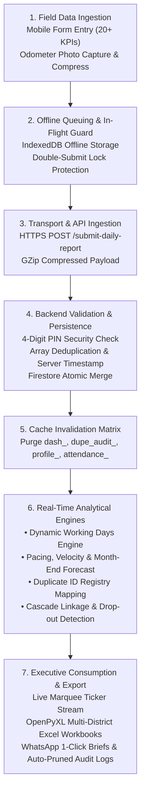

# 🔄 Data Processing & Feature Specification: DFY TB MIS

> **Doctors For You (DFY) - Tuberculosis Elimination Field MIS**  
> *Author:* Health Informatics & Analytics Engineering  
> *Platform:* FastAPI Backend + Google Cloud Firestore + React 19 Engine  
> *Coverage:* 22+ Districts in Bihar, India  
> *Version:* 2.4.0 (Enterprise Production-Hardened)

---

## 1. End-to-End Data Processing Pipeline

The platform ingests clinical records from mobile field workers, validates them against programmatic business logic, computes real-time analytical indicators, and disseminates actionable intelligence to program managers.



---

## 2. Step-by-Step Data Processing Lifecycle

### Step 1: Field Data Ingestion & Mobile Entry
- Field health advocates record daily patient interactions via the mobile PWA (`App.jsx`).
- **Input Sanitization & Normalization**:
  - Patient IDs (Nikshay registration numbers) entered as comma-separated or space-separated strings are automatically stripped of whitespace, normalized to uppercase, and filtered for minimum length ($\ge 5$ characters).
  - Odometer morning and evening photos are converted to base64 or stored in Firebase Cloud Storage, recording travel distance.

### Step 2: Offline Resilience & Sync Engine
- **IndexedDB Store (`dfy_offline_reports`)**:
  - When `navigator.onLine === false` or if an HTTP socket fails, the submission payload is saved to the local device's IndexedDB queue.
  - The officer receives an immediate confirmation: `📴 Internet nahi hai. Report phone me safe save ho gayi hai!`.
  - When network restores (`window.addEventListener('online')`), the queue automatically dispatches pending reports in chronological order with zero data loss.

### Step 3: In-Flight Validation & Concurrency Protection
- **Double-Submit Prevention**: The `submitReport()` handler checks `if (isSubmitting) return;`. This eliminates accidental duplicate requests from double-tapping under slow 3G/4G connections.
- **PIN Verification**: Verifies the officer's 4-digit PIN against `staff_directory` using an in-memory cached lookup (`pin_{doc_id}`).

### Step 4: Backend Ingestion & Document Mutation
- **Route**: `POST /submit-daily-report`
- **Document Key Formulation**:
  $$\\text{Doc ID} = \\text{lowercase}(\\text{sanitize}(\\text{working\\_place} + \"\\_\" + \\text{fo\\_name} + \"\\_\" + \\text{date}))$$
- **Array Deduplication & Merge Logic**:
  If an officer submits multiple updates for the same day (e.g. morning tests + evening notifications):
  ```python
  # Deduplicate patient IDs without losing prior entries
  combined = d.get(field_key, []) + new_ids
  payload[field_key] = list(dict.fromkeys(combined))
  ```
- **Remark Chaining**: Multiple operational remarks throughout the day are chained with divider bars: `\"Morning clinic visit | Evening contact tracing in block X\"`.
- **Server Timestamp**: Stamped with `firestore.SERVER_TIMESTAMP` for auditable submission chronology.

### Step 5: In-Memory TTL Cache Invalidation
Upon successful persistence, the backend immediately executes prefix-based cache invalidation:
```python
cache.delete(f"status_{doc_id}")
cache.delete_prefix("dash_")
cache.delete_prefix("dupe_audit_")
cache.delete_prefix("attendance_")
cache.delete_prefix("profile_")
cache.delete_prefix("cascade_alerts_")
```
This guarantees that subsequent dashboard queries pull fresh data while maintaining sub-millisecond RAM response speeds for concurrent reads.

---

## 3. Real-Time Analytical & Calculation Engines

### 3.1 Dynamic Working Days & Calendar Modeling Engine
To compute accurate run-rates, the platform dynamically calculates real working days for any selected month:

1. **Total Calendar Days ($D_{\\text{total}}$)**:
   $$D_{\\text{total}} = \\text{Days in the month (28, 29, 30, or 31)}$$
2. **Sunday Elimination ($S_{\\text{count}}$)**:
   Scans day 1 to month-end and identifies all Sundays ($S_{\\text{count}} \\in [4, 5]$).
3. **Declared Government Holidays ($H_{\\text{declared}}$)**:
   Admin-adjustable counter (default: 1 holiday, adjustable 0–10) reflecting state/festival holidays (Chhath, Diwali, Eid, etc.).
4. **Formulas**:
   $$W_{\\text{total}} = D_{\\text{total}} - S_{\\text{count}} - H_{\\text{declared}}$$
   $$W_{\\text{elapsed}} = \\text{Working days elapsed up to current date (excluding Sundays & holidays)}$$
   $$W_{\\text{remaining}} = \\max(0, W_{\\text{total}} - W_{\\text{elapsed}})$$

---

### 3.2 Staff Target Pacing, Velocity & Month-End Forecasting Engine

For every field staff member (ADC, TC, FO):

| Metric | Formula | Clinical Meaning |
|---|---|---|
| **Expected Benchmark to Date** | $$T_{\\text{expected}} = \\text{round}\\left(\\frac{T}{W_{\\text{total}}} \\times W_{\\text{elapsed}}\\right)$$ | Pro-rated target an officer should have achieved by today |
| **Pacing Health Ratio (%)** | $$\\text{Pacing } \\% = \\text{round}\\left(\\frac{A}{T_{\\text{expected}}} \\times 100\\%\\right)$$ | How fast the officer is running relative to elapsed time |
| **Current Daily Velocity** | $$V_{\\text{actual}} = \\frac{A}{\\max(1, W_{\\text{elapsed}})}$$ | Average notifications logged per working day |
| **Required Recovery Velocity** | $$V_{\\text{recovery}} = \\frac{\\max(0, T - A)}{\\max(1, W_{\\text{remaining}})}$$ | Daily notifications required for remaining working days to hit target |
| **Projected Month-End Finish** | $$\\text{Projected} = \\text{round}(A + (V_{\\text{actual}} \\times W_{\\text{remaining}}))$$ | Forecasted total notifications at month-end based on current pace |
| **Forecast Gap (Surplus/Deficit)** | $$\\text{Forecast Gap} = \\text{Projected} - T$$ | Over-achievement (+) or shortfall (-) in notifications |

#### Traffic Light Classification:
- 🟢 **Ahead / On Track**: $\\text{Pacing } \\% \\ge 90\\%$
- 🟡 **Watchlist / Needs Push**: $70\\% \\le \\text{Pacing } \\% < 90\\%$
- 🔴 **Critical Lag / At Risk**: $\\text{Pacing } \\% < 70\\%$

---

### 3.3 Cross-Officer Patient ID Duplicate Detection Engine
- **Purpose**: Prevents duplicate counting of the same TB patient by different field officers or across multiple days.
- **Algorithm**:
  1. The backend builds an inverted index `id_registry[patient_id] = [{fo_name, district, date, category}, ...]`.
  2. Identifies all IDs where `len(occurrences) > 1`.
  3. Classifies each repeated ID:
     - **Same-Category Duplicates**: Same patient ID reported twice in the *same* programmatic category (e.g. two separate notifications for the same patient). Flagged as **Critical Data Anomaly**.
     - **Cross-Category Linkages**: Same patient ID reported across *different* categories (e.g. Notification on Day 2, then Sample Tested on Day 5, then DBT on Day 10). Recognized as **Valid Cascade Progression**.

---

### 3.4 Clinical Cascade & Drop-out Detection Engine
- Cross-references each patient ID in `notification_ids` against downstream service arrays:
  $$\\text{Notification ID} \\xrightarrow{\\text{link check}} \\{\\text{HIV/DM}, \\text{DBT}, \\text{Outcome}, \\text{TPT}\\}$$
- **Dropout Classifications**:
  - **CRITICAL DROPOUT**: Notification active $>14$ days with neither HIV/DM screening nor DBT account linking.
  - **PARTIAL LINKAGE**: HIV/DM screened, but bank account DBT pending (risk of patient missing government nutritional support).
  - **CASCADE COMPLETE**: Fully linked with diagnostic, financial, and treatment outcome confirmation.

---

### 3.5 Real-Time Attendance Radar Engine
- Compares the active staff roster from `staff_directory` against today's submitted reports from `daily_field_reports`:
  $$\\text{Missing Staff} = \\text{Staff Directory} \\setminus \\text{Today Submissions}$$
- Categorizes staff into:
  - **Submitted Full** (Reported $\\ge 1$ patient interactions or active travel)
  - **Submitted Partial** (Only morning odometer photo logged, afternoon clinical report pending)
  - **Missing / Absent** (Zero reports received by cut-off time)

---

### 3.6 Automated 30-Day Audit Trail Retention Engine
- **Lifecycle of an Administrative Action**:
  1. Target edit, ID deletion, or user creation triggers `log_admin_activity()`.
  2. Appends document to `admin_audit_logs` collection with `timestamp: YYYY-MM-DD HH:MM:SS`.
  3. Every 6 hours and upon server boot, `prune_expired_audit_logs(30)` evaluates:
     $$\\text{cutoff} = (\\text{now} - 30\\text{ days}).\\text{strftime}(\"%Y-%m-%d %H:%M:%S\")$$
  4. Deletes matching documents via Firestore batch commits (`db.batch().delete(doc.reference)`).
  5. The UI displays an active retention status chip: `🛡️ Retention: 30 Days (Auto-Pruned)`.

---

### 3.7 Excel Reporting & Streaming Engine (`openpyxl`)
- Utilizes `openpyxl` with predefined professional formatting constants:
  - `EXCEL_HEADER_BORDER`, `EXCEL_THIN_BORDER`, `EXCEL_TOTAL_ROW_BORDER`.
  - Auto-computed column widths: $\\text{width} = \\max(\\text{cell length}) + 4$.
  - Number formatting: centered numbers, left-aligned officer names.
- **District ZIP Streamer**: Streams all 22+ district `.xlsx` files compressed on-the-fly into a single `.zip` archive via `StreamingResponse(io.BytesIO(...))` with zero temporary disk file footprint on Render.

---

## 4. Comprehensive Clinical Indicator Catalog

The system tracks 22 standardized clinical and programmatic indicators:

| # | Indicator Key | Display Label | Category | Data Format | Nikshay Relevance & Programmatic Role |
|---|---|---|---|---|---|
| 1 | `notification_ids` | Notifications | The Big 5 | Array of Strings | Core Nikshay TB Patient Registration ID |
| 2 | `sample_tested_ids` | Samples Tested | The Big 5 | Array of Strings | CBNAAT, TrueNat, or Microscopy specimen IDs |
| 3 | `presumptive_ids` | Presumptive TB | The Big 5 | Array of Strings | Suspected TB cases identified in community |
| 4 | `visited_names` | Doctor Visits | The Big 5 | Array of Strings | Private practitioners & clinics visited for notification |
| 5 | `total_km` | Travel KM | The Big 5 | Integer (km) | Field transit verification based on odometer photos |
| 6 | `hiv_dm_ids` | HIV & DM Screened | Group 1 (Linkages) | Array of Strings | Comorbidity screening for HIV and Diabetes |
| 7 | `dbt_ids` | DBT Linked | Group 1 (Linkages) | Array of Strings | Bank account linkage for Nikshay Poshan Yojana (Rs. 500/mo) |
| 8 | `sample_collection_ids`| Sample Collection | Group 2 (Diagnostics)| Array of Strings | Sputum specimens collected from community |
| 9 | `outcome_assigned_ids` | Outcome Assigned | Group 2 (Diagnostics)| Array of Strings | Treatment outcome confirmed (Cured / Completed) |
| 10 | `home_visit_ids` | Home Visits | Group 3 (Outreach) | Array of Strings | In-person household visits for treatment adherence |
| 11 | `contact_tracing_ids` | Contact Tracing | Group 3 (Outreach) | Array of Strings | Household contacts screened for secondary TB |
| 12 | `follow_up_ids` | Follow Ups | Group 3 (Outreach) | Array of Strings | Periodic adherence and symptom checks |
| 13 | `face_to_face_ids` | Face to Face | Group 3 (Outreach) | Array of Strings | Patient counseling and stigma reduction |
| 14 | `documents_ids` | Documents Collected| Group 4 (Logistics) | Array of Strings | Identity proofs, bank passbooks, consent forms |
| 15 | `fdc_provided_ids` | FDC Provided | Group 4 (Logistics) | Array of Strings | Fixed-Dose Combination anti-TB medicine packs delivered |
| 16 | `kit_consumption_ids` | Specimen Kits Used | Group 4 (Logistics) | Array of Strings | Diagnostic kits utilized during field testing |
| 17 | `differentiated_tb_ids`| Differentiated TB | Group 5 (Advanced) | Array of Strings | High-risk TB assessment (Severe malnutrition, respiratory rate) |
| 18 | `tpt_treatment_start_ids`| TPT Started | Group 5 (Advanced) | Array of Strings | TB Preventive Treatment initiated for household contacts |
| 19 | `tpt_presumptive_ids` | TPT Presumptive | Group 5 (Advanced) | Array of Strings | Contacts evaluated for preventive therapy eligibility |
| 20 | `adhar_face_auth_ids` | Aadhaar Face Auth | Group 5 (Advanced) | Array of Strings | Biometric authentication on UIDAI / Nikshay portal |
| 21 | `consent_with_id_ids` | Consent with ID | Group 5 (Advanced) | Array of Strings | Signed programmatic consent forms filed |
| 22 | `culture_dst_ids` | Culture / DST | Group 5 (Advanced) | Array of Strings | Drug Susceptibility Testing & Line Probe Assay (Buxar specific) |
