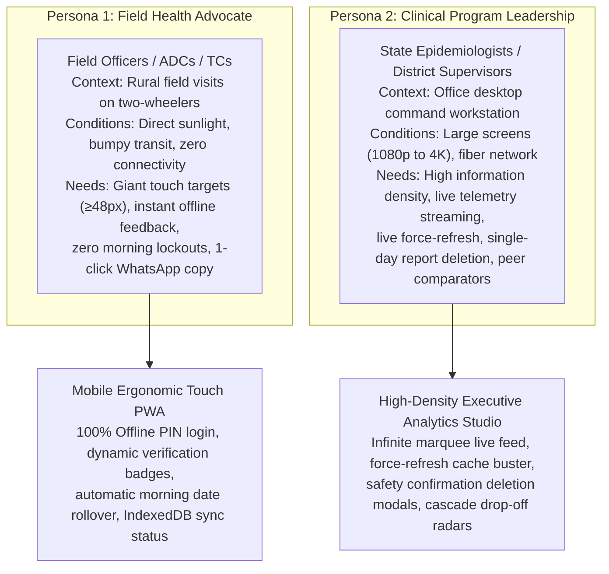

# 🎨 UI/UX Design System Specification: DFY TB MIS

> **Doctors For You (DFY) - Tuberculosis Elimination Field MIS**  
> *Author:* UI/UX Engineering & Design Systems Team  
> *Design Framework:* Tailwind CSS v4 + React 19 + Lucide Icons  
> *Typography:* Plus Jakarta Sans  
> *Target Form Factors:* Mobile PWA (Field Staff) & Responsive Desktop Studio (Administrators)  
> *Version:* 3.5.0 (v2.8.3 - Bento Visual Flowcharts, Next-Day Radar Badging, Cohort Notation & Direct Dialing)  
> *Status:* Production Active

---

## 1. Design Philosophy & Dual-Persona UX Architecture

The DFY TB MIS interface solves a unique dual-persona challenge in healthcare informatics:



---

## 2. Design Tokens & Visual Identity System

### 2.1 Primary Palette & Functional Color Tokens

| Semantic Token | Hex Code | Tailwind Class | Application / Meaning |
|---|---|---|---|
| **Slate Command Base** | `#0F172A` | `bg-slate-900` | Command headers, live activity ticker background, high-contrast badges |
| **Slate Surface Neutral**| `#F8FAFC` | `bg-slate-50` | Primary app canvas background, soft borders, muted cards |
| **Indigo Master Accent** | `#4F46E5` | `bg-indigo-600` | Primary interactive buttons, state averages, active navigation tabs, Medical Leave |
| **Emerald Ahead / On Track**| `#10B981` | `bg-emerald-500` | Pacing ≥90%, successful submissions, online sync complete, verified PIN, Present Duty |
| **Amber Watchlist / Warning**| `#F59E0B` | `bg-amber-500` | Pacing 70%-89%, needs pace boost, offline banner, next-day morning badge, Casual Leave |
| **Rose Critical / At Risk**| `#F43F5E` | `bg-rose-500` | Pacing <70%, cascade dropouts, report delete modal, urgent login alerts, Absent / Defaulter |
| **Blue Official Duty** | `#3B82F6` | `bg-blue-500` | Official Duty (OD), government review meetings, training sessions |
| **Cyan Clinical Accent** | `#06B6D4` | `bg-cyan-500` | Culture / DST specialized testing indicator, laboratory badges |

### 2.2 Typography Hierarchy (`Plus Jakarta Sans`)
- **Display Headings**: `font-black tracking-tight` (Hero numbers, officer names, executive KPI totals)
- **Section Headers**: `font-bold text-sm tracking-wide uppercase`
- **Data Labels**: `text-[10px] sm:text-xs font-bold text-slate-500 uppercase tracking-wider`
- **Body & Numerical Values**: `font-semibold font-mono` for IDs, dates, and precision percentages.

### 2.3 Surface Elevation & Corner Radii
- Cards & Modals: `rounded-2xl` (16px) or `rounded-3xl` (24px) with subtle borders (`border border-slate-200/80`).
- Shadows: Soft, diffuse ambient shadows (`shadow-sm`, `shadow-md`, `shadow-xl`) to avoid harsh contrast.
- Glassmorphism: `backdrop-blur-md bg-white/90` or `bg-slate-900/80` for persistent sticky bars and modal scrims.

---

## 3. Offline-First & Field Reliability UX Components

### 3.1 Reactive Offline Status & Queue Badging
Positioned prominently in the top application header:
- **Offline Active Badge**: When `!isOnline`, renders an amber capsule badge:
  ```jsx
  <div className="flex items-center gap-1.5 bg-amber-50 text-amber-800 border-amber-200 px-2.5 py-1 rounded-full text-[10px] font-bold">
    <span className="w-1.5 h-1.5 rounded-full bg-amber-500 animate-pulse" />
    <span>📴 Offline</span>
  </div>
  ```
- **Sync Pending Action Pill**: When offline reports exist (`offlineQueueCount > 0`) and device reconnects, transforms into an emerald pulsing button:
  ```jsx
  <button className="flex items-center gap-1.5 bg-emerald-50 text-emerald-800 border-emerald-200 px-2.5 py-1 rounded-full text-[10px] font-bold animate-pulse cursor-pointer">
    <span className="w-1.5 h-1.5 rounded-full bg-emerald-500" />
    <span>Sync (N)</span>
  </button>
  ```
  Clicking immediately fires `triggerOfflineSync()` with real-time toast feedback.

### 3.2 Instant PIN Authentication Feedback Loop
The 4-digit PIN input features real-time dynamic micro-feedback directly beneath the field:
- **Checking State**: `Verifying PIN...` with indigo pulsing text.
- **Offline Verified State**: `✓ Offline PIN Verified` with an emerald checkmark.
- **Online Verified State**: `✓ PIN Verified` with emerald highlight and ring elevation.
- **Error State**: `✕ Sahi 4-digit PIN darj karein` with rose ring outline (`ring-2 ring-red-200`).
- **Emergency Field Duty Mode**: Informational toast notifying the officer: `"📴 Offline Duty Mode: Sham ko server se verify ho jayega."` allowing immediate data entry without delay.

### 3.3 Seamless Morning Rollover Experience
- When an officer opens the PWA on a new day while in a zero-network village, the UI skips the login screen, rolls the session date to `today`, and presents the daily entry form immediately.
- Eliminates morning authentication failure anxiety and ensures 100% attendance recording.

---

## 4. Executive Command & Administrative UX Components

### 4.1 Continuous Live Activity Marquee Ticker
- **Visual Spec**: Sleek dark slate command bar (`bg-slate-900 text-white rounded-2xl`) positioned prominently at the top of the Overview tab.
- **Hardware-Accelerated Infinite Scrolling**:
  - Powered by `@keyframes tickerMarquee { 0% { transform: translate3d(0, 0, 0); } 100% { transform: translate3d(-50%, 0, 0); } }`.
  - Duplicates recent field submissions array seamlessly (`[...recentItems, ...recentItems]`).
- **Micro-Interactions**:
  - **Hover / Touch Hold to Pause**: Halts scrolling on hover/touch.
  - **Manual Play / Pause Toggle (`▶️ / ⏸️`)**: Touchscreen control.
  - **1-Click Drill-Down**: Clicking any live chip immediately filters the dashboard to that specific officer and district.

### 4.2 Live Force-Refresh Action Control
- Located in the Admin Header next to the date/month selector.
- Features a vibrant emerald icon button: `🔄 Refresh`.
- Triggers `fetchData(true)`, rotates the refresh icon with CSS transition, and displays a toast confirming: `"✓ Fresh live data fetched directly from Firestore!"`.

### 4.3 Atomic Single-Day Report Deletion Modal
- Inside the Field Officer Detailed Inspector, each date card displays a discreet red action: `🗑️ Delete Day`.
- **Safety Confirmation Dialog**:
  - Displays high-contrast red warning badge: `⚠️ Confirm Daily Report Deletion`.
  - Clearly summarizes impact: Date, Officer Name, Total Nikshay/Sample IDs to be permanently removed, and vehicle KM rollback.
  - Requires explicit confirmation button click (`Delete Report`) before dispatching `POST /admin/reports/delete-day`.
  - Optimistically updates the inspector cards and recalculates month-to-date targets and pacing without needing a full page reload.

### 4.4 Traffic Light Status Badging & Color Grading
- Applied consistently across Pacing Matrices, Cards, and Comparators:
  - 🟢 **Ahead / On Track (Pacing ≥ 90%)**: Emerald pill badge, glowing pulse dot, projected to meet/exceed target.
  - 🟡 **Watchlist / Needs Push (Pacing 70% - 89%)**: Amber pill badge, needs mild velocity increase.
  - 🔴 **Critical Lag / At Risk (Pacing < 70%)**: Rose pill badge with alert triangle, projected to miss target without immediate field intervention.

### 4.5 Dual Officer Head-to-Head Benchmark Comparator (Officer A vs Officer B)
- Two symmetric visual cards placed side-by-side with a central `VS` lightning badge.
- Comparative Metrics: Target vs Actual, Velocity ($V_{\text{actual}}$ vs $V_{\text{recovery}}$), Month-End Projection, and Specialized Clinical Indicators (Culture/DST, Presumptive, DBT).
- **1-Click WhatsApp Coaching Note**: Generates a structured bilingual (Hindi/English) memo with performance stats, required pace, and motivation.

### 4.6 Clinical Cascade & Patient Dropout Radar
- Visual horizontal funnel displaying:
  $$\text{Notification} \longrightarrow \text{HIV/DM Screening} \longrightarrow \text{DBT Account Linking} \longrightarrow \text{Treatment Outcome}$$
- Severity tags: `CRITICAL` (Missing both HIV/DM and DBT), `WARNING` (Missing one vital linkage), `ON TRACK` (Complete clinical linkage).

### 4.7 Automated Daily Cloud Backup & Disaster Recovery Modal
- **Access Control**: Visible strictly to `SUPER_ADMIN` via top action bar (`💾 Backups`) and Command Deck Governance cluster.
- **Visual Design**:
  - **Today's Status Card**: Emerald pulsating dot indicator (`✓ Up-to-Date & Active`), cloud bucket region (`🇮🇳 Mumbai, India`), and 30-day retention badge.
  - **On-Demand Action Banner**: Indigo callout card with `⚡ Backup Now` button and spinner animation.
  - **Snapshots History Table**: Clean monospace filenames, creation dates, compressed file sizes in KB, record counts, and provenance tags (`Automated Daily` vs `Manual Admin`).
  - **Direct 1-Click Download**: `📥 Download` button initiates direct browser stream of `.json.gz` archive.
  - **Emergency Disaster Recovery Drawer**: Safety-guarded restore interface requiring typed confirmation keyword `RESTORE-CONFIRM`.

### 4.8 Attendance Radar Next-Day Morning Badge & 5-Status Leave Management
- **Next-Day Morning Badge**:
  - Rendered in Attendance Radar for submissions completed before 10:00 AM:
    ```jsx
    <span className="inline-flex items-center gap-1 px-2 py-0.5 rounded-md text-[10px] font-bold bg-amber-50 text-amber-800 border border-amber-200/80 shadow-2xs">
      <span className="w-1.5 h-1.5 rounded-full bg-amber-500 animate-pulse" />
      <span>⏰ Next day morning {time}</span>
    </span>
    ```
  - Includes descriptive tooltip explaining the grace period attribution to yesterday ($D-1$).
- **Retroactive Remark & Leave Modal (`AttendanceLeaveModal`)**:
  - Modal features 5 status chips with immediate visual preview:
    - 🟢 Present (`bg-emerald-50 text-emerald-800 border-emerald-200`)
    - 🔵 Official Duty (`bg-blue-50 text-blue-800 border-blue-200`)
    - 🟡 Casual Leave (`bg-amber-50 text-amber-800 border-amber-200`)
    - 🟣 Medical Leave (`bg-indigo-50 text-indigo-800 border-indigo-200`)
    - 🔴 Absent / Uninformed (`bg-rose-50 text-rose-800 border-rose-200`)
  - Real-time sync reflects immediately in Field Officer calendar with corresponding colored dot and supervisor inspection note.

### 4.9 Master Detailed Table Documents Cohort Analytics (`C:X | P:Y`)
- **Compact Cohort Notation**:
  - High-density monospace split format inside Documents Collected column:
    ```jsx
    <div className="flex items-center gap-1.5 font-mono text-xs">
      <span className="px-1.5 py-0.5 rounded bg-blue-50 text-blue-700 font-bold border border-blue-200" title="Current Month Cohort">
        C:{docCur}
      </span>
      <span className="text-slate-300">|</span>
      <span className="px-1.5 py-0.5 rounded bg-slate-100 text-slate-700 font-bold border border-slate-200" title="Previous Month Backlog Cohort">
        P:{docPrev}
      </span>
    </div>
    ```
  - Highlights active clinical priority: whether staff are gathering compliance papers for new enrollments or clearing historical backlog.
  - Dynamically updates based on the 3-way cohort switch: `All`, `Current Month Cohort`, or `Backlog Cohort`.

### 4.10 Nikshay Reconciler Direct Patient Contacts & 1-Tap Calling UX
- **Card-Based Contact Drawer**:
  - In Nikshay Reconciler, Clinical Dropout Radar, and Patient Journey Tracker, each patient row displays an accessible contact pill.
- **1-Tap Direct Dial Action**:
  ```jsx
  <a href={`tel:${patientPhone}`} className="inline-flex items-center gap-1 px-2.5 py-1 bg-emerald-600 hover:bg-emerald-700 text-white rounded-lg text-xs font-bold transition-all shadow-xs active:scale-95">
    <span>📞</span>
    <span>Call</span>
  </a>
  ```
- **Copy-to-Clipboard Feedback**:
  - Micro-animation displaying `✓ Copied!` tooltip with 1.5s automatic reversion, preventing double-press confusion.

---

## 5. Mobile Ergonomics & Accessibility

1. **Touch Target Enforcement**:
   - Every interactive control (accordion toggles, number steppers, pill filters, submit buttons) maintains a minimum height and tap boundary of `48px`.
2. **Browser Spinner Suppression**:
   - Number inputs suppress native spinners (`::-webkit-inner-spin-button { display: none }`) to prevent accidental value alterations while scrolling on mobile touchscreens.
3. **Contrast & Field Visibility**:
   - Uses high-contrast typography (`text-slate-800` on `bg-white`) optimized for bright outdoor daylight conditions encountered during two-wheeler field transit.

---

## 6. 100% Native Bento Visual Flowchart Design System

The system transitions all operational guidelines and standard operating procedures (SOPs) away from dense, unreadable text walls into modern, high-contrast **Native Bento Visual Flowcharts**.

### 6.1 Component Architecture & Layout Rules
- **Container Structure**: Responsive CSS Grid (`grid grid-cols-1 md:grid-cols-2 lg:grid-cols-3 gap-3.5`).
- **Visual Flow Progression**:
  - **Sequence Badges**: High-visibility numerical badges (`1➔2➔3`) indicating chronological step flow.
  - **SVG Flow Connectors**: Curved or directional SVG arrows visually linking input actions to output states.
  - **Tactical Micro-Cards**: Self-contained step cards with rounded corners (`rounded-2xl`), border highlights (`border border-slate-200/80`), and distinct background tints.
  - **Pro-Tip Callout Banners**: Distinct bottom callout strips (`💡 Tip: ...`) with emerald or amber left borders.

### 6.2 Bento Thematic Color Schemes

| Theme | Border & Tint | Header & Badging | Context / Meaning |
|---|---|---|---|
| **Emerald (Success / Online)** | `border-emerald-200 bg-emerald-50/40` | `text-emerald-800 bg-emerald-100` | Verified registrations, on-time submissions, online auto-sync |
| **Amber (Notice / Grace)** | `border-amber-200 bg-amber-50/40` | `text-amber-800 bg-amber-100` | Casual leave, pacing watchlists, pending sync queue |
| **Indigo (Core Pipeline)** | `border-indigo-200 bg-indigo-50/40` | `text-indigo-800 bg-indigo-100` | Clinical cascade progression, doctor visits, master table drilldowns |
| **Rose (Critical / Alert)** | `border-rose-200 bg-rose-50/40` | `text-rose-800 bg-rose-100` | Defaulter streaks, duplicate notification blocks, report deletions |
| **Slate (Structural / Architecture)** | `border-slate-200 bg-slate-50/60` | `text-slate-800 bg-slate-200` | System setup, directory rosters, cloud backup archives |

### 6.3 Zero-Leakage Privacy Design Rule
- In the Field Officer Help Guide (`App.jsx`):
  - Every visual diagram strictly illustrates the **7:00 PM evening reporting cutoff**.
  - Visual timeline tracks: `Morning 9:00 AM (Duty Start) ➔ Afternoon 2:00 PM (Visits & Testing) ➔ Evening 7:00 PM (Submit Report)`.
  - The 10:00 AM administrative grace cutoff is completely excluded from FO UI diagrams to preserve programmatic reporting discipline.
