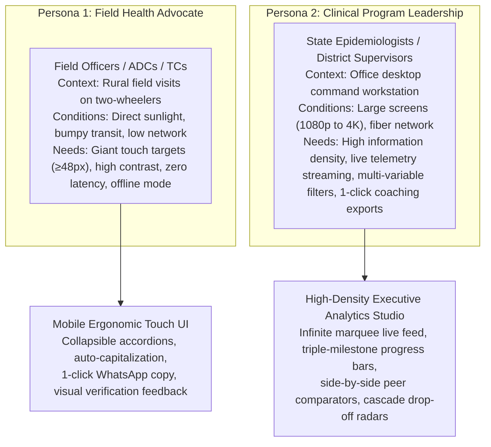
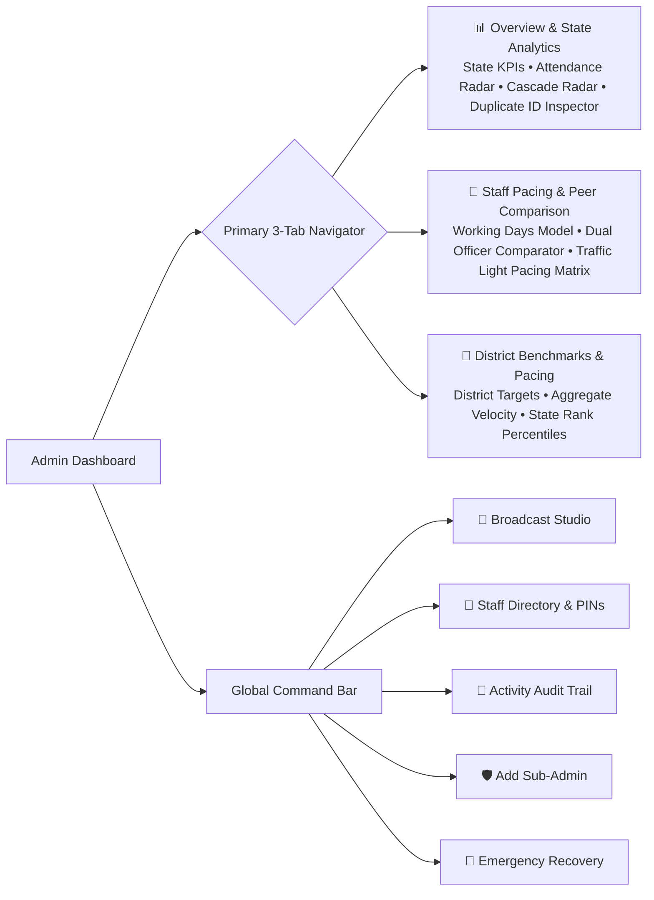

# 🎨 UI/UX Design System Specification: DFY TB MIS

> **Doctors For You (DFY) - Tuberculosis Elimination Field MIS**  
> *Author:* UI/UX Engineering & Design Systems Team  
> *Design Framework:* Tailwind CSS v4 + React 19 + Lucide Icons  
> *Typography:* Plus Jakarta Sans  
> *Target Form Factors:* Mobile PWA (Field Staff) & Responsive Desktop Studio (Administrators)

---

## 1. Design Philosophy & Dual-Persona UX Architecture

The DFY TB MIS interface solves a unique dual-persona challenge in healthcare informatics:

---

## 2. Design Tokens & Visual Identity System

### 2.1 Primary Palette & Functional Color Tokens

| Semantic Token | Hex Code | Tailwind Class | Application / Meaning |
|---|---|---|---|
| **Slate Command Base** | `#0F172A` | `bg-slate-900` | Command headers, live activity ticker background, high-contrast badges |
| **Slate Surface Neutral**| `#F8FAFC` | `bg-slate-50` | Primary app canvas background, soft borders, muted cards |
| **Indigo Master Accent** | `#4F46E5` | `bg-indigo-600` | Primary interactive buttons, state averages, active navigation tabs |
| **Emerald Ahead / On Track**| `#10B981` | `bg-emerald-500` | Pacing ≥90%, successful submissions, target exceeded indicators |
| **Amber Watchlist / Warning**| `#F59E0B` | `bg-amber-500` | Pacing 70%-89%, needs pace boost, medium priority broadcasts |
| **Rose Critical / At Risk**| `#F43F5E` | `bg-rose-500` | Pacing <70%, cascade dropouts, delete actions, urgent login popups |
| **Cyan Clinical Accent** | `#06B6D4` | `bg-cyan-500` | Culture / DST specialized testing indicator, laboratory badges |

### 2.2 Typography Hierarchy (`Plus Jakarta Sans`)
- **Display Headings**: `font-black tracking-tight` (Hero numbers, officer names, executive KPI totals)
- **Section Headers**: `font-bold text-sm tracking-wide uppercase`
- **Data Labels**: `text-[10px] sm:text-xs font-bold text-slate-500 uppercase tracking-wider`
- **Body & Numerical Values**: `font-semibold font-mono` for IDs, dates, and precision percentages.

### 2.3 Surface Elevation & Corner Radii
- Cards & Modals: `rounded-2xl` (16px) or `rounded-3xl` (24px) with subtle borders (`border border-slate-200/80`).
- Shadows: Soft, diffuse ambient shadows (`shadow-sm`, `shadow-md`, `shadow-xl`) to avoid harsh contrast.
- Glassmorphism: `backdrop-blur-md bg-white/90` or `bg-slate-900/80` for persistent sticky bars and modal scrims.

---

## 3. Navigation Architecture & Information Hierarchy

---

## 4. Core Component Specifications

### 4.1 Continuous Live Activity Marquee Ticker
- **Visual Spec**: Sleek dark slate command bar (`bg-slate-900 text-white rounded-2xl`) positioned prominently at the top of the Overview tab.
- **Hardware-Accelerated Infinite Scrolling**:
  - Powered by `@keyframes tickerMarquee { 0% { transform: translate3d(0, 0, 0); } 100% { transform: translate3d(-50%, 0, 0); } }`.
  - Duplicates the recent 16 field submissions array seamlessly (`[...recentItems, ...recentItems]`) creating an endless horizontal stream without visual jumps.
- **Micro-Interactions**:
  - **Hover / Touch Hold to Pause**: Halts scrolling on mouse enter so admins can inspect details.
  - **Manual Play / Pause Toggle (`▶️ / ⏸️`)**: Full user control for touchscreens.
  - **1-Click Drill-Down**: Clicking any live activity chip immediately sets the District and Field Officer filters to drill down into that officer.
  - **Edge Gradient Masks**: Dual fading masks (`bg-gradient-to-r from-slate-900 to-transparent`) ensure items emerge and exit naturally.

### 4.2 Traffic Light Status Badging & Color Grading
- Visual classification applied consistently across Pacing Matrices, Cards, and Comparators:
  - 🟢 **Ahead / On Track (Pacing ≥ 90%)**: Emerald pill badge, glowing pulse dot, projected to meet/exceed target.
  - 🟡 **Watchlist / Needs Push (Pacing 70% - 89%)**: Amber pill badge, needs mild velocity increase.
  - 🔴 **Critical Lag / At Risk (Pacing < 70%)**: Rose pill badge with alert triangle, projected to miss target without immediate field intervention.

### 4.3 Dual Officer Head-to-Head Benchmark Comparator (Officer A vs Officer B)
- **Layout**: Two symmetric visual cards placed side-by-side with a central `VS` lightning badge.
- **Comparative Metrics Displayed**:
  - Target vs Actual Notifications.
  - Current Daily Velocity ($V_{\\text{actual}}$) vs Required Recovery Pace ($V_{\\text{recovery}}$).
  - Month-End Projected Finish & Surplus/Deficit.
  - Clinical Indicators Breakdown: Culture/DST, Presumptive TB, Tests, Contact Tracing.
- **Dynamic Leader Badges**:
  - Automatically awards `👑 Leading in Pace`, `⚡ Higher Daily Run-Rate`, or `🎯 Highest Volume` to the leading officer.
- **1-Click WhatsApp Coaching Note**:
  - Generates an instant bilingual (Hindi/English) structured coaching memo with performance stats, pace required, and motivation.
  - One-click copy with clipboard toast notification.

### 4.4 Clinical Cascade & Patient Dropout Radar
- **Visual Design**: Multi-stage horizontal funnel showing drop-off stages:
  $$\\text{Notification} \\longrightarrow \\text{HIV/DM Screening} \\longrightarrow \\text{DBT Account Linking} \\longrightarrow \\text{Treatment Outcome}$$
- **Severity Tagging**:
  - `CRITICAL` (Missing both HIV/DM and DBT after notification).
  - `WARNING` (Missing one vital linkage).
  - `ON TRACK` (Complete clinical linkage).

### 4.5 Central Broadcast Studio & Login Scrim Popup
- **Priority-Driven Alert Scrim**:
  - `HIGH Priority`: Triggers an unmissable modal dialog immediately upon user login. Acknowledging saves to `localStorage` to avoid repeated annoyance, but persists in the top bulletin.
  - `MEDIUM Priority`: Amber highlight banner in top bulletin board.
  - `INFO Priority`: Indigo announcement pill in bulletin board.
- **Audience Scoping**: Radio selectors for `All Team`, `Field Staff Only`, or `Sub-Admins Only`.

---

## 5. Responsive Design & Touch Optimization

1. **Mobile Ergonomic Guard**:
   - Number inputs have native browser spinners suppressed (`::-webkit-inner-spin-button { display: none }`).
   - Touch targets for all buttons and inputs maintain a minimum height of `48px`.
2. **Offline Visual Indicators**:
   - Amber banner displays when device goes offline: `📴 Offline Mode: Reports safely queued in phone`.
   - Flashes emerald confirmation toast when auto-synced upon reconnection.
