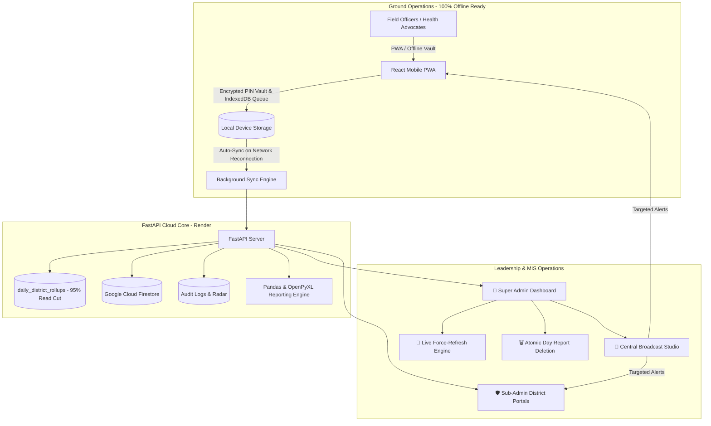

# 🩺 Doctors For You (DFY) - TB Field MIS & Analytics System

[](https://github.com/evilsaurav/dfy-mis-app)
[](https://github.com/evilsaurav/dfy-mis-app)
[](https://fastapi.tiangolo.com)
[](https://reactjs.org/)
[](https://vitejs.dev/)
[](https://tailwindcss.com/)
[](https://firebase.google.com/)
[](https://www.python.org/)
[](https://web.dev/progressive-web-apps/)

An enterprise-grade, offline-first **Management Information System (MIS)** and **Clinical Analytics Platform** built for **Doctors For You (DFY)** to monitor, evaluate, and accelerate Tuberculosis (TB) elimination operations across 22+ districts in Bihar, India.

---

## 📚 Enterprise Technical Documentation

For in-depth architectural blueprints, UI/UX design systems, and data processing specifications, refer to our dedicated documentation guides:
- 🏗️ **[System Architecture Specification (ARCHITECTURE.md)](ARCHITECTURE.md)**: Cloud-native distributed topology, 100% offline PIN authentication vault, Render 512MB RAM concurrency hardening, atomic district rollups (95% read cut), in-memory TTL caching, and deployment runbooks.
- 🎨 **[UI/UX Design System Specification (DESIGN.md)](DESIGN.md)**: Visual identity, color tokens, continuous live activity marquee ticker, dual officer peer comparator, traffic-light status badging, offline queue indicators, and delete day safety modal.
- 🔄 **[Data Processing & Feature Pipeline (DATA_PROCESSING.md)](DATA_PROCESSING.md)**: End-to-end data lifecycle, offline IndexedDB sync, working-days dynamic engine, velocity formulas, patient deduplication algorithms, 30-day auto-pruned audit engine, and complete 22-indicator catalog.

---

## 📑 Table of Contents

- [Overview & Architecture](#-overview--architecture)
- [Key Features](#-key-features)
  - [1. 100% Offline-First Field Officer Mobile PWA](#1-100-offline-first-field-officer-mobile-pwa)
  - [2. Executive Analytics & Reports Studio](#2-executive-analytics--reports-studio)
  - [3. Clinical Cascade & Patient Dropout Radar](#3-clinical-cascade--patient-dropout-radar)
  - [4. Cross-Officer Duplicate ID Radar](#4-cross-officer-duplicate-id-radar)
  - [5. Enterprise RBAC & Single-Day Report Deletion](#5-enterprise-rbac--single-day-report-deletion)
  - [6. Broadcast & Urgent Announcement System](#6-broadcast--urgent-announcement-system)
  - [7. Audit Trail Radar & Security Recovery](#7-audit-trail-radar--security-recovery)
  - [8. Attendance Radar Leave & Absence Tracking Engine](#8--attendance-radar-leave--absence-tracking-engine)
  - [9. Staff Active/Inactive Lifecycle & Historical Retrospection](#9--staff-activeinactive-lifecycle--historical-retrospection)
  - [10. Field Officer Target Pacing Command Card & Dynamic Working Days](#10--field-officer-target-pacing-command-card--dynamic-working-days)
  - [11. Multi-Tier Duplicate Notification Prevention & 1-Click Auto-Repair Suite](#11--multi-tier-duplicate-notification-prevention--1-click-auto-repair-suite)
- [Districts Covered](#-districts-covered)
- [Tech Stack](#-tech-stack)
- [Project Directory Structure](#-project-directory-structure)
- [API Endpoints Reference](#-api-endpoints-reference)
- [Installation & Local Setup](#-installation--local-setup)
- [Environment Variables](#-environment-variables)
- [Deployment Guide](#-deployment-guide)
- [License & Credits](#-license--credits)

---

## 🏗️ Overview & Architecture

The DFY TB MIS platform bridges ground-level field workers and central leadership in real time:



---

## 🚀 Key Features

### 1. 📱 100% Offline-First Field Officer Mobile PWA
- **Encrypted Local PIN Vault (`dfy_pin_vault`)**:
  - Salting and SHA-256 Web Crypto hashing store credentials locally.
  - FO can log in and verify their PIN anywhere in remote rural areas with **zero internet connection**.
- **Automatic Morning Date Rollover**:
  - Automatically updates session dates to `today` when workers wake up or enter remote field zones without logging out, eliminating morning authentication lockout.
- **Emergency Field Duty Mode**:
  - If a health worker uses a replacement phone or cleared browser cache deep in a zero-network village, valid 4-digit PINs activate Emergency Duty Mode, ensuring TB patient registrations are never blocked.
- **IndexedDB Offline Queue & Reactive Auto-Sync**:
  - Reports submitted offline are stored safely in IndexedDB (`DFY_MIS_OFFLINE_DB`).
  - Auto-sync triggers seamlessly on app launch or the instant network connectivity is restored.
- **Live Visual Network Indicators**:
  - Top header displays `📴 Offline` when disconnected and `Sync (N)` when reports are pending in queue.
  - Interactive PIN feedback: `Verifying PIN...`, `✓ Offline PIN Verified`, or `✕ Sahi 4-digit PIN darj karein`.
- **20+ Clinical Indicators**:
  - Grouped into collapsible accordion workflows (Notifications, HIV/DM, DBT, Sample Collection, Tested, Culture/DST, Contact Tracing, FDC Medicine Kits, Aadhaar Face Auth, Doctor Visits).
- **1-Click WhatsApp Formatter**: Formats daily metrics into emoji-enriched text ready for official monitoring groups.

---

### 2. 📊 Executive Analytics & Reports Studio
- **Strict Staff Directory Alignment**:
  - The dashboard pacing matrix binds strictly to official staff directory records (`staffDirectory`).
  - String sanitization and canonical district mapping eliminate duplicate or phantom staff rows.
- **Live Force-Refresh Engine (`force_refresh: true`)**:
  - Header green "Refresh" button purges in-memory RAM cache prefixes and disk snapshots, streaming fresh data directly from Firestore.
- **Atomic District Rollups (`daily_district_rollups`)**:
  - Slashes daily Firestore read operations by **95%** using atomic increments for metric counters.
- **Real-Time Attendance Radar**: Matches directory rosters against today's submissions to immediately highlight missing reports.
- **Head-to-Head Peer Comparator**: Dual officer comparative cards with velocity metrics and 1-click bilingual coaching memos.
- **5-in-1 Executive Export Studio**:
  1. *State Master Consolidation (.xlsx)*
  2. *District Drilldown Workbook (.xlsx)*
  3. *Clinical Dropout Action Sheet (.xlsx)*
  4. *Single Officer Performance Dossier (.xlsx)*
  5. *1-Click State ZIP Package*

---

### 3. 🚨 Clinical Cascade & Patient Dropout Radar
- **End-to-End Cascade Tracking**: Follows each registered patient ID through the clinical funnel:
  $$\text{Notification} \longrightarrow \text{HIV/DM Screening} \longrightarrow \text{DBT Account Linking} \longrightarrow \text{Treatment Outcome}$$
- **Automated Dropout Detection**: Highlights missing clinical linkages per patient ID with severity levels (`CRITICAL`, `WARNING`, `ON TRACK`).

---

### 4. 🛡️ Cross-Officer Duplicate ID Radar
- **Statewide Nikshay ID Audit**: Scans for duplicate patient IDs entered across different officers, dates, or districts.
- **Conflict Resolution & Correction**: Admins can inspect duplicate occurrences, view diff logs, and correct typos with full audit logging.

---

### 5. 🔐 Enterprise RBAC & Single-Day Report Deletion
- **Role Hierarchy**:
  - `SUPER_ADMIN`: Statewide visibility across all 22+ districts, user provisioning, global settings, target management, staff PIN directory, report deletion across all districts, and statewide broadcast control.
  - `SUB_ADMIN`: District-isolated dashboard, reports, attendance, and cascade alerts strictly restricted to assigned districts (`allowed_districts`).
- **Atomic Staff Day Report Deletion (`POST /admin/reports/delete-day`)**:
  - Administrators can delete erroneous single-day reports for any field officer.
  - Enforces Sub-Admin RBAC guards (rejects deletions outside assigned districts).
  - Automatically rolls back rollup counters (`notifications`, `tests`, etc.), removes officer from `submitted_fos`, purges caches, and writes an immutable audit record.
  - Features a high-stakes safety confirmation dialog in the UI.

---

### 6. 📢 Broadcast & Urgent Announcement System
- **Central Broadcast Studio**: Publish directives targeted to `ALL`, `FIELD_STAFF`, or `SUB_ADMINS`.
- **Urgent Modal Popup on Login**: `HIGH` priority broadcasts display an unmissable modal dialog on user login/open.
- **Persistent Notice Board**: Notices remain highlighted in top bulletin banners on both the Field App and Admin Dashboard until dismissed.

---

### 7. 📜 Audit Trail Radar & Security Recovery
- **Immutable Action Logging**: Every target change, patient ID edit, PIN reset, day report deletion, and broadcast is logged with actor name, role, district, and diff details.
- **Automated 30-Day Retention**: Background engine prunes expired audit records in batches, maintaining compliance and preventing database bloat.
- **Zero-Budget Emergency Recovery**: Master security key (`DFY-RESCUE-9921`) and PIN (`7788`) self-recovery mechanism for administrator credential resets.

---

### 8. 🌴 Attendance Radar Leave & Absence Tracking Engine
- **1-Click Modal Leave Tagging (`AttendanceLeaveModal`)**:
  - Coordinators can mark any field officer as on leave or absent directly from the Missing Staff list with a single click.
  - Supports structured absence categorization: `Medical`, `Casual`, `Official Work`, `Personal`, and `Uninformed`, along with custom coordinator remarks.
- **Dedicated "On Leave (N)" Tab**:
  - Staff marked on leave are automatically segregated into an independent "On Leave" radar view with distinct purple badging (`bg-purple-50 text-purple-700`).
  - Includes a 1-click **"Unmark Leave" / "Restore"** action (`POST /admin/attendance/unmark-leave`) that safely returns the officer to active attendance tracking without penalties.
- **Smart WhatsApp Summary Auto-Exclusion**:
  - The 1-click WhatsApp daily attendance digest generator automatically excludes staff on leave from the "Missing Officers" roster.
  - Generates a clean, categorized `🌴 Chhuti Par (On Leave)` roster in the final text, ensuring state leadership receives crisp, actionable morning summaries.
- **Atomic Cache Eviction & RBAC Isolation**:
  - Leave records persist in Firestore collection `daily_staff_leaves` with keys `{date}_{district}_{fo_name}`.
  - Automatically purges date-scoped attendance cache keys (`attendance_{date}_*`).
  - Strict Sub-Admin RBAC validation prevents coordinators from marking or modifying leave for staff outside their assigned districts (HTTP 403).

---

### 9. 👥 Staff Active/Inactive Lifecycle & Historical Retrospection
- **Zero Historical Data Corruption**:
  - When field staff resign, transfer, or complete their tenure, administrators can toggle their status to `INACTIVE` with a single click.
  - Automatically records an `inactive_since` date timestamp (`YYYY-MM-DD`).
  - Past daily reports, monthly KPI aggregates, historical district rollups, and audit trails for deactivated staff remain 100% intact and uncorrupted.
- **Strict Date Cutoff Isolation (`inactive_since`)**:
  - In `GET /admin/today-attendance`, staff deactivated before or on the queried date are completely excluded from attendance rosters.
  - When reviewing historical dates prior to their deactivation, staff correctly appear in the attendance roster, preserving accurate historical field accountability.
- **Hardened Inactive PIN Verification Lockout**:
  - `/verify-pin` rejects inactive staff with HTTP 403: *"Aapka account inactive hai. Kripya State Coordinator se sampark karein."*
  - Completely blocks inactive or relieved personnel from submitting reports or logging into the PWA.
- **Admin Staff Management Suite**:
  - Staff management directory features fast filter tabs: `All`, `Active`, and `Inactive`.
  - Color-coded action buttons: Red "Deactivate" / Emerald "Reactivate" with high-stakes confirmation dialogs (`StaffStatusToggleModal`).
  - Sub-Admin RBAC guards enforce district isolation on `POST /admin/staff/toggle-status`.

---

### 10. 🎯 Field Officer Target Pacing Command Card & Dynamic Working Days
- **Modern Glassmorphic Field Command Card**:
  - Integrated into the Field Officer mobile PWA Profile tab (`App.jsx`).
  - Features dual-track visual progress rings contrasting **Notification Achievement Progress** against **Elapsed Working Days Progress**.
- **Dynamic Calendar Math & Holiday Synchronization**:
  - Automatically calculates real working days for any month:
    $$W_{\text{total}} = D_{\text{total}} - S_{\text{count}} - H_{\text{declared}}$$
  - Identifies and excludes all calendar Sundays ($S_{\text{count}} \in [4, 5]$).
  - Dynamically fetches state/district declared government holidays ($H_{\text{declared}}$) via `GET /admin/pacing/settings` and `/my-profile-stats`.
- **Actionable Run-Rate Velocity Analytics**:
  - **Current Daily Run-Rate ($V_{\text{actual}}$)**: $\frac{\text{Achieved Notifications}}{\max(1, W_{\text{elapsed}})}$
  - **Required Recovery Velocity ($V_{\text{recovery}}$)**: $\frac{\max(0, \text{Target} - \text{Achieved})}{\max(1, W_{\text{remaining}})}$
  - Dynamic status indicator badges: `🟢 On Track` ($\ge 90\%$), `🟡 At Risk` ($70\% - 89\%$), or `🔴 Behind Target` ($< 70\%$).
  - Displays remaining notifications needed to achieve monthly targets.

---

### 11. 🛡️ Multi-Tier Duplicate Notification Prevention & 1-Click Auto-Repair Suite
- **90-Day Offline District Notification Registry (IndexedDB)**:
  - Mobile devices cache all notification IDs registered across the district within the active 90-day clinical treatment window via `GET /api/district-notification-registry`.
  - Enables instant 0ms duplicate detection in remote villages with zero mobile connectivity.
- **Strict Red Block Modal (`DuplicateNotificationBlockModal`)**:
  - TB Notifications are legally and clinically unique to initial diagnosis (1 notification per patient).
  - Repeat notification entries for already-registered Nikshay IDs are strictly halted with an unmissable red warning dialog.
- **Interactive Amber Confirmation Modal (`RepeatInterventionConfirmModal`)**:
  - For non-notification indicators (Home Visits, Follow-ups, DBT, FDC Kits), repeat entries are valid clinical re-interventions.
  - Displays an amber advisory requiring explicit officer confirmation before adding the repeat ID to the tally.
- **Server Ingestion Auto-Pruning Gate (`POST /submit-daily-report`)**:
  - Safely auto-prunes duplicate notification IDs from counters before committing to Firestore.
  - Preserves all valid clinical work (visitations, testing, DBT, remarks) without failing the submission.
- **Admin Duplicate Radar 1-Click Auto-Repair Suite**:
  - Scans cross-date and cross-officer duplicate notifications (`GET /admin/scan-duplicate-notifications`).
  - 1-click repair endpoint (`POST /admin/repair-duplicate-notifications`) strips duplicate notification IDs from records and atomically decrements inflated `daily_district_rollups` with Sub-Admin RBAC validation.

---

## 📍 Districts Covered

The system supports active staff and reporting across **22+ Districts of Bihar**:

| Region | Districts Covered |
|---|---|
| **North Bihar** | Darbhanga, Madhubani, Muzaffarpur, Purba Champaran (East Champaran), Sheohar, Sitamarhi, Vaishali |
| **South Bihar** | Aurangabad, Bhojpur, Buxar, Gaya, Jamui, Jehanabad, Kaimur, Nawada, Rohtas |
| **East & Central** | Begusarai, Khagaria, Lakhisarai, Munger, Samastipur, Sheikhpura |

---

## 💻 Tech Stack

### Frontend
- **Framework**: [React 19](https://react.dev/) + [Vite 8](https://vitejs.dev/)
- **Routing**: [React Router v7](https://reactrouter.com/)
- **Styling**: [Tailwind CSS v4](https://tailwindcss.com/)
- **Visualizations**: [Recharts 3.10](https://recharts.org/)
- **Offline Storage**: IndexedDB (`DFY_MIS_OFFLINE_DB`) + `localStorage` Web Crypto Vault
- **PWA**: Service Worker caching via `vite-plugin-pwa`

### Backend
- **Framework**: [FastAPI](https://fastapi.tiangolo.com/) (Python 3.10+)
- **Server**: [Uvicorn](https://www.uvicorn.org/) (ASGI)
- **Data Processing**: [Pandas](https://pandas.pydata.org/)
- **Excel Engineering**: [OpenPyXL](https://openpyxl.readthedocs.io/)
- **Validation**: [Pydantic v2](https://docs.pydantic.dev/)

### Database & Cloud
- **Primary Store**: [Google Cloud Firestore](https://firebase.google.com/docs/firestore)
- **Hosting / Deployments**: [Render](https://render.com/) (API Web Service), Vercel / Netlify (Frontend)

---

## 📂 Project Directory Structure

```
Mis field report/
├── main.py                     # FastAPI Backend: APIs, RBAC, Firebase, Excel exports, Audits & Rollups
├── requirements.txt            # Python dependencies
├── staff_master.csv            # Master staff directory & district assignments
├── firebase_key.json           # Firebase Admin Service Account credentials (git-ignored)
├── generate_templates.py       # Helper scripts for Excel template generation
├── templates/                  # Excel KPI report templates & assets
├── tests/                      # Automated Python and Node test batteries
│   ├── test_attendance_leaves_and_lifecycle.py
│   ├── test_district_registry.py
│   ├── test_ingestion_defense.py
│   ├── test_repair_duplicate_notifications.py
│   └── test_scoped_caching.py
│
└── dfy-frontend/               # React 19 + Vite Frontend Application
    ├── index.html              # App entry HTML with PWA meta tags
    ├── package.json            # Node dependencies and build scripts
    ├── vite.config.js          # Vite build configuration & PWA setup
    ├── public/
    │   ├── manifest.json       # Progressive Web App (PWA) manifest
    │   └── favicon.svg         # DFY brand icon
    └── src/
        ├── App.jsx             # Field Officer Mobile PWA: offline PIN, pacing card, duplicate modals
        ├── AdminDashboard.jsx  # Central Admin & Sub-Admin Analytics Dashboard with Attendance Leaves & Repair Suite
        ├── changelogData.js    # Client-side in-app changelog & version history
        ├── offlineQueue.js     # IndexedDB offline storage & auto-sync engine
        ├── staff_directory.json # Master local baseline staff directory
        ├── main.jsx            # React root mount point & Router
        └── index.css           # Tailwind CSS imports & animations
```

---

## 🔌 API Endpoints Reference

### 1. Field Reporting & Staff Authentication
| Method | Endpoint | Description |
|---|---|---|
| `POST` | `/verify-pin` | Verify 4-digit staff PIN (blocks inactive staff accounts with HTTP 403) |
| `POST` | `/submit-daily-report` | Submit daily clinical report & patient IDs (idempotent, rollups, duplicate notification auto-pruning) |
| `POST` | `/check-today-status` | Check if officer has submitted a report today |
| `POST` | `/my-profile-stats` | Fetch officer-specific monthly summary, dynamic working days & pacing velocity |
| `GET` | `/api/district-notification-registry` | Fetch 90-day district notifications for offline IndexedDB duplicate prevention cache |

### 2. Admin Analytics, RBAC & Report Management
| Method | Endpoint | Description |
|---|---|---|
| `POST` | `/admin/login` | Admin & Sub-Admin credentials login with RBAC permissions |
| `POST` | `/admin/dashboard-data` | Filtered analytics data, KPIs, leaderboard & target pacing (`force_refresh` support) |
| `POST` | `/admin/reports/delete-day` | Delete an officer's single-day report with atomic rollup rollback & RBAC |
| `GET` | `/admin/attendance/live` | Live field staff attendance radar (submitted vs missing) |
| `GET` | `/admin/today-attendance` | Live attendance radar with date cutoff (`inactive_since`), submitted vs missing vs on-leave resolution |
| `GET` | `/admin/users/list` | Super Admin: List all Admin and Sub-Admin accounts |
| `POST` | `/admin/users/create` | Super Admin: Provision new Sub-Admin user with permitted districts |
| `POST` | `/admin/users/update` | Super Admin: Update user permissions and assigned districts |
| `POST` | `/admin/emergency-reset` | Emergency master key / PIN password reset |

### 3. Attendance Leaves & Staff Lifecycle
| Method | Endpoint | Description |
|---|---|---|
| `POST` | `/admin/attendance/mark-leave` | Mark staff as on-leave/absent with reason category, remark, and Sub-Admin RBAC |
| `POST` | `/admin/attendance/unmark-leave` | Revert staff from leave back to active attendance tracking with Sub-Admin RBAC |
| `POST` | `/admin/staff/toggle-status` | Toggle staff `ACTIVE`/`INACTIVE` status with `inactive_since` cutoff date and Sub-Admin RBAC |
| `GET` | `/admin/pacing/settings` | Fetch declared government holidays and calendar pacing settings for month/district |
| `POST` | `/admin/pacing/settings` | Update declared government holidays per month (statewide default or district override) with RBAC |

### 4. Target Management & Staff Suite
| Method | Endpoint | Description |
|---|---|---|
| `GET` | `/get-targets` | Fetch monthly targets (filtered by permitted districts) |
| `POST` | `/set-targets` | Update monthly targets with audit trail logging |
| `GET` | `/staff-directory` | Fetch normalized master staff directory |
| `GET` | `/admin/staff/list` | Fetch active/inactive staff list with PINs, designations, and status badges |
| `POST` | `/admin/staff/update-pin` | Reset staff member PIN |
| `GET` | `/admin/staff/export-pins` | Export master PIN directory to Excel (`.xlsx`) |

### 5. Cascade Alerts & Duplicate Notification Radar
| Method | Endpoint | Description |
|---|---|---|
| `GET` | `/api/reports/cascade-alerts` | Fetch clinical cascade dropouts and patient dropout alerts |
| `GET` | `/admin/export-cascade-alerts` | Export clinical cascade dropout action sheet (`.xlsx`) |
| `GET` | `/api/duplicate-audit` | Scan and report duplicate patient IDs across officers |
| `POST` | `/api/edit-record-id` | Correct / replace patient ID with audit trail record |
| `GET` | `/admin/scan-duplicate-notifications` | Deep scan for cross-date duplicate notification IDs within a month, with Sub-Admin RBAC |
| `POST` | `/admin/repair-duplicate-notifications` | 1-click auto-repair of duplicate notification documents with atomic rollup rollback and Sub-Admin RBAC |

### 6. Broadcasts & Announcements
| Method | Endpoint | Description |
|---|---|---|
| `POST` | `/api/broadcasts/create` | Create targeted broadcast notice with RBAC validation |
| `GET` | `/api/broadcasts/active` | Get active broadcasts filtered by district & role |
| `GET` | `/api/broadcasts/all` | List all broadcasts in Central Broadcast Studio |
| `POST` | `/api/broadcasts/delete` | Deactivate/delete broadcast notice across all portals |

### 7. Excel Report Studio Exports
| Method | Endpoint | Description |
|---|---|---|
| `GET` | `/admin/export-state-summary` | Download Statewide Executive Consolidation (`.xlsx`) |
| `GET` | `/download-district-kpi` | Download District-specific drilldown workbook (`.xlsx`) |
| `GET` | `/admin/export-fo-dossier` | Download Single Officer Performance Dossier (`.xlsx`) |

### 8. Automated Cloud Backups & Disaster Recovery (Option A)
| Method | Endpoint | Description |
|---|---|---|
| `GET` | `/admin/backup/status` | Super Admin: Live backup status, storage bucket location, and snapshots list |
| `POST` | `/admin/backup/trigger-now` | Super Admin: On-demand immediate database snapshot creation |
| `GET` | `/admin/backup/download/{filename}` | Super Admin: Stream compressed `.json.gz` backup archive directly to local device |
| `POST` | `/admin/backup/restore` | Super Admin: Emergency disaster recovery restore with `RESTORE-CONFIRM` safety guard |

---

## 🛠️ Installation & Local Setup

### Prerequisites
- Python 3.10+
- Node.js 18+ and npm
- Google Cloud Firebase project with Firestore enabled

### 1. Clone the Repository
```bash
git clone https://github.com/evilsaurav/dfy-mis-app.git
cd dfy-mis-app
```

### 2. Backend Setup
```bash
# Create and activate virtual environment
python -m venv venv
source venv/bin/activate  # On Windows: venv\Scripts\activate

# Install dependencies
pip install -r requirements.txt

# Run FastAPI backend server
uvicorn main:app --host 0.0.0.0 --port 8000 --reload
```
Backend will be live at `http://localhost:8000` with Swagger docs at `http://localhost:8000/docs`.

### 3. Frontend Setup
```bash
cd dfy-frontend

# Install dependencies
npm install

# Run Vite development server
npm run dev
```
Frontend will be live at `http://localhost:5173`.

---

## ⚙️ Environment Variables

### Frontend (`dfy-frontend/.env`)
```env
VITE_API_URL=http://localhost:8000
```
*(For production, set `VITE_API_URL` to your live backend domain, e.g., `https://dfy-mis-app.onrender.com`)*

### Backend
Place your Firebase Service Account JSON credentials file as `firebase_key.json` in the root directory, or configure `FIREBASE_CREDENTIALS` environment variable.

---

## 🚢 Deployment Guide

### Backend (Render.com)
1. Create a **Web Service** on Render pointing to your GitHub repository.
2. Build Command: `pip install -r requirements.txt`
3. Start Command: `uvicorn main:app --host 0.0.0.0 --port $PORT`
4. Add your Firebase secret key and JWT secret key under Environment variables.

### Frontend (Netlify / Vercel)
1. Link your GitHub repository.
2. Base Directory: `dfy-frontend`
3. Build Command: `npm run build`
4. Publish Directory: `dist`
5. Environment Variable: `VITE_API_URL=https://<your-backend-render-app>.onrender.com`

---

## 📜 License & Credits

Developed with ❤️ for **Doctors For You (DFY)** Bihar TB Elimination Program.  
Designed and architected by **Insomniac**.

For queries, bug reports, or feature enhancements, please open an issue in the [GitHub repository](https://github.com/evilsaurav/dfy-mis-app).
