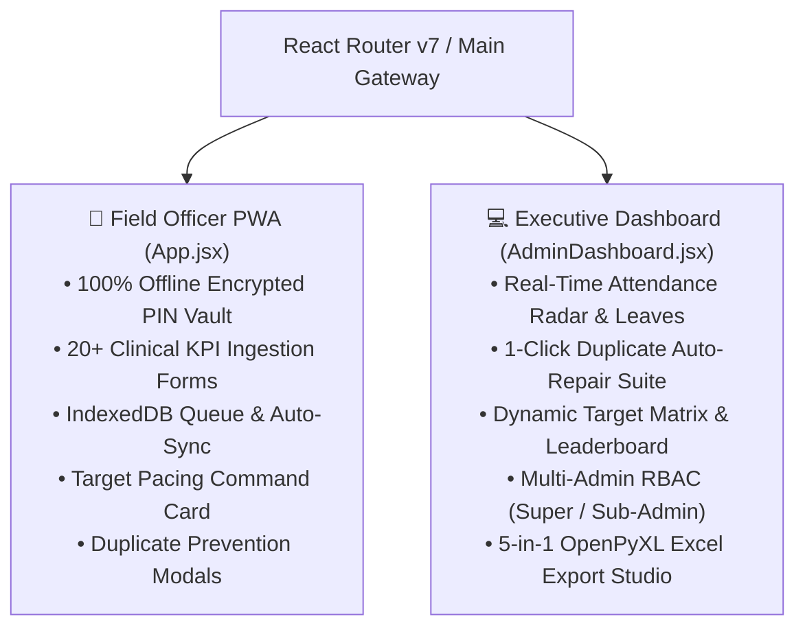

# 📱 Doctors For You (DFY) - React 19 Field PWA & Analytics Dashboard

[](https://react.dev/)
[](https://vitejs.dev/)
[](https://tailwindcss.com/)
[](https://oxc.rs/)
[](https://web.dev/progressive-web-apps/)

The frontend layer of the **DFY TB MIS** platform: a lightning-fast, offline-first Progressive Web Application (PWA) built with **React 19** and **Vite 8**. Engineered specifically for low-connectivity rural health operations across 22+ districts in Bihar, India.

---

## 🏗️ Core Architecture & Portals

The frontend houses two primary runtime experiences:



---

## 🌟 Key Frontend Systems & Capabilities

### 1. 📴 100% Offline PIN Vault & Emergency Field Duty
- **Web Crypto Hashing**: SHA-256 local salted hashing stores credentials in `dfy_pin_vault` (`localStorage`), allowing health workers to authenticate in zero-signal areas.
- **Morning Rollover Safety**: Automatically shifts session dates to `today` when waking up in rural locations, preventing morning lockout without requiring an online handshake.
- **Emergency Duty Mode**: Unlocks reporting even on replacement devices or cleared caches deep in the field.

### 2. 📦 IndexedDB Offline Queue & Zero-Loss Sync (`offlineQueue.js`)
- Submissions made offline are safely serialized into IndexedDB (`DFY_MIS_OFFLINE_DB`).
- Automatically senses connectivity via `window.addEventListener('online')` and flushes queued reports chronologically with anti-double-tap protection.

### 3. 🚨 Multi-Tier Duplicate Notification Defense
- **Local 90-Day District Registry**: IndexedDB caches active TB notifications across the district for 0ms offline duplicate checks.
- **Strict Red Block Modal (`DuplicateNotificationBlockModal`)**: Blocks duplicate notification entry, enforcing NTEP 1-notification-per-patient policy.
- **Amber Confirmation Modal (`RepeatInterventionConfirmModal`)**: Confirms repeat entries for valid longitudinal interventions (Visits, DBT, FDC).

### 4. 🎯 FO Profile Target Pacing Command Card
- Glassmorphic command card in the Profile tab (`App.jsx`).
- Dual-track circular SVG progress rings contrasting notification achievement against elapsed working days.
- Dynamic calendar math deducting Sundays and declared government holidays synced from the backend (`GET /admin/pacing/settings`).
- Computes real-time daily run-rate ($V_{\text{actual}}$) and required recovery velocity ($V_{\text{recovery}}$).

### 5. 🌴 Real-Time Attendance Radar & Leave Tagging
- Matches live daily submissions against master directory rosters.
- 1-click **Mark Leave Modal** (`AttendanceLeaveModal`) with categories: `Medical`, `Casual`, `Official Work`, `Personal`, `Uninformed`.
- Segregates staff on leave into a dedicated "On Leave" tab with purple badging.
- Generates 1-click bilingual WhatsApp attendance digests that automatically exclude approved leaves from the missing roster.

### 6. 📜 In-App Release History & Changelog Modal (`changelogData.js`)
- Client-side in-app changelog modal with zero Firestore read cost.
- Automatically notifies users of new updates with version badges and highlights.

---

## 🚀 Available Scripts

In the `dfy-frontend/` directory:

| Command | Description |
|---|---|
| `npm run dev` | Starts Vite local dev server with HMR at `http://localhost:5173` |
| `npm run build` | Compiles optimized production bundle with tree-shaking into `dist/` |
| `npm run lint` | Runs ultra-fast Oxlint linter for syntax & hook safety checks |
| `npm run preview` | Previews the local production build in `dist/` |

---

## 🛠️ Verification & Quality Protocol

Per project production engineering protocols (`GEMINI.md`):
1. **Oxlint**: Must pass with 0 syntax errors: `npm run lint`.
2. **Vite Build**: Must compile with exit code 0: `npm run build`.
3. **Temporal Dead Zone (TDZ) Guard**: Always declare base states first (`useState`), then derived collections (`useMemo`), then handlers, then effects. Never reference variables before their lexical declaration.
4. **Anti-Double-Tap Guards**: Every export, mutation, and submit button must have an immediate loading/disabled state (`isSubmitting`, `isDownloading`).

---

## ⚙️ Environment Variables

Create a `.env` file in `dfy-frontend/`:

```env
# Local development
VITE_API_URL=http://localhost:8000

# Production (e.g. Render / Cloud Run)
# VITE_API_URL=https://dfy-mis-app.onrender.com
```

---

## 📜 License & Credits

Developed with ❤️ for **Doctors For You (DFY)** Tuberculosis Elimination Program, Bihar.
