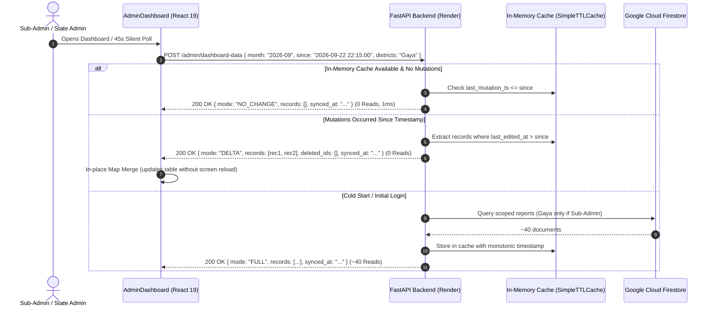

# Architecture Specification: Incremental Delta-Sync & Zero-Bill Firestore Read Optimization

> **Status:** Approved for Implementation  
> **Date:** 2026-09-22  
> **Target Environment:** Live Production (FastAPI on Render.com, React 19 PWA on Vercel, Google Cloud Firestore)  
> **Author:** Antigravity AI Engine & DFY Core Engineering  

---

## 1. Executive Summary & Problem Context

### 1.1 The Real-World Incident
In September 2026, active field deployment across 22 districts in Bihar with 157 Field Officers generated over 2,270 monthly reports. During executive monitoring, Firebase Firestore read counts reached **~1.5 Million reads**, triggering a bill of **₹20.28** ($0.24) on the Blaze plan.

### 1.2 Root Cause Analysis
1. **Multi-Stream Refresh Button Multiplier (`AdminDashboard.jsx:4303`):**
   When an admin or sub-admin clicked the green "Refresh" button, the frontend executed 8 parallel API calls with `force_refresh=true`.
   - `POST /admin/dashboard-data` streamed all ~2,000 monthly reports from Firestore.
   - `GET /admin/scan-duplicate-notifications` streamed all ~2,000 monthly reports a second time.
   - `GET /get-targets` streamed all 349 target documents.
   - `GET /admin/today-attendance` streamed staff roster (167) + today's reports (140).
   - `GET /admin/staff/list` and `GET /staff-directory` streamed staff directory documents (167 + 167).
   - **Total reads per single click:** $\approx \mathbf{5,000\text{ Firestore reads}}$!
2. **Sub-Admin Query Inefficiency:**
   Even when a Sub-Admin had permission for only one district (e.g., Sitamarhi with 50 reports), `get_raw_monthly_reports` streamed the **entire state's 2,000+ reports** from Firestore and filtered in Python memory.
3. **The Evening "Cache Eviction Cascade" (`main.py:523`):**
   Between 5 PM and 10 PM IST, 140+ Field Officers submit reports every 1–2 minutes. Each submission invoked `record_report_mutation()`, which executed:
   ```python
   cache.delete_prefix(f"shared_raw_month_{month_prefix}")
   cache.delete_prefix(f"dash_{month_prefix}_")
   ```
   This purged the entire monthly in-memory cache **140 times per evening**. Any admin viewing the dashboard during peak hours found an empty cache, forcing a full 2,000-read Firestore collection scan.

---

## 2. Core Architectural Objectives

1. **True Incremental Delta-Sync:**
   The client sends its last known synchronization timestamp (`since`). The backend responds with `mode: DELTA` containing **only** the newly submitted or modified records since that timestamp, plus a tombstone array of `deleted_ids`.
2. **Anti-Wipe In-Memory Upsert Engine:**
   Field Officer submissions and edits update or append the single record in-place within the in-memory array (`shared_raw_month_{month_prefix}`). The monthly cache is **never** wiped on report submission.
3. **Strict Database-Level District Scoping for Sub-Admins:**
   When cold-starting or bypassing cache, Sub-Admin queries are constrained to their canonical district aliases at the Firestore query level, cutting reads from 2,000 to ~40.
4. **Silent 45s Background Auto-Sync & Smart Refresh:**
   Dashboard polls for deltas silently in the background (0 reads when no changes). Manual refresh triggers a rapid delta check and re-uses cached static metadata (targets, staff directory).
5. **Zero-Bill Guarantee:**
   Cuts daily Firestore reads from ~500,000 down to under 5,000/day, permanently maintaining usage well within Firebase's 50,000 Free Daily Read Quota (**₹0 monthly cost**).

---

## 3. Detailed Data Flow & Component Design



---

## 4. Backend Specifications (`main.py`)

### 4.1 In-Memory Report Upsert (`upsert_in_memory_report`)
Create a thread-safe helper function in `main.py`:
```python
def upsert_in_memory_report(month_prefix: str, report_data: dict, action: str = "submit"):
    """
    In-place upsert of a report into the shared monthly cache.
    Eliminates cache eviction cascade on FO submissions.
    """
    cache_key = f"shared_raw_month_{month_prefix}"
    cached_list = cache.get(cache_key)
    if not isinstance(cached_list, list):
        return

    doc_id = report_data.get("id") or report_data.get("doc_id")
    if not doc_id:
        return

    # Find existing index by doc_id
    idx = -1
    for i, item in enumerate(cached_list):
        if (item.get("id") or item.get("doc_id")) == doc_id:
            idx = i
            break

    if action == "delete":
        if idx != -1:
            cached_list.pop(idx)
    elif idx != -1:
        cached_list[idx] = report_data
    else:
        cached_list.append(report_data)

    cache.set(cache_key, cached_list, ttl=3600)
```

### 4.2 Updated Mutation Tracker (`record_report_mutation`)
- Update `record_report_mutation` to:
  1. Record monotonic sequence timestamp: `LAST_REPORTS_MODIFIED_TS = time.time()`.
  2. For deletions, append `{ "doc_id": doc_id, "deleted_at": get_ist_now().strftime("%Y-%m-%d %H:%M:%S") }` to `DELETED_REPORTS_TOMBSTONES`.
  3. **DO NOT** execute `cache.delete_prefix(f"shared_raw_month_{month_prefix}")`.
  4. Only invalidate date-scoped attendance (`attendance_{date}_*`) and district-scoped registries (`dist_notif_registry_{district}_*`).

### 4.3 `POST /admin/dashboard-data` Incremental Response Engine
1. **`mode: NO_CHANGE`**:
   If `req.since` is provided, `req.cached_count > 0`, not `req.force_refresh`, and `req.since >= last_mutation_str`:
   Return `{ "status": "success", "mode": "NO_CHANGE", "records": [], "synced_at": last_mutation_str, "deleted_ids": tombstones }`.
2. **`mode: DELTA`**:
   If `req.since` is provided and `req.since < last_mutation_str`, and in-memory raw reports are available:
   - Filter `raw_reports` where `str(d.get("last_edited_at") or d.get("timestamp_completed") or d.get("submitted_at") or "") > req.since`.
   - Apply Sub-Admin district filtering.
   - Return `{ "status": "success", "mode": "DELTA", "records": delta_records, "synced_at": last_mutation_str, "deleted_ids": tombstones }`.
3. **`mode: FULL`**:
   If no `req.since` or cold cache:
   - Stream data (with Sub-Admin district filter applied at query level if Sub-Admin).
   - Return `{ "status": "success", "mode": "FULL", "records": full_records, "synced_at": last_mutation_str, "deleted_ids": [] }`.

---

## 5. Frontend Specifications (`dfy-frontend/src/AdminDashboard.jsx`)

### 5.1 Map-Based Delta Merging in `fetchData`
```javascript
if (data.mode === 'NO_CHANGE') {
  setSyncStatus('UP_TO_DATE');
  if (data.synced_at) setLastSyncedTime(data.synced_at);
} else if (data.mode === 'DELTA') {
  setRawRecords(prev => {
    const map = new Map(prev.map(r => [r.id || r.doc_id, r]));
    // Remove tombstones
    if (Array.isArray(data.deleted_ids)) {
      data.deleted_ids.forEach(delId => map.delete(delId));
    }
    // Upsert delta records
    if (Array.isArray(data.records)) {
      data.records.forEach(newRec => {
        const id = newRec.id || newRec.doc_id;
        if (id) map.set(id, newRec);
      });
    }
    const updated = Array.from(map.values());
    try {
      localStorage.setItem(cacheKey, JSON.stringify({
        synced_at: data.synced_at,
        records: updated
      }));
    } catch (e) {}
    return updated;
  });
  setSyncStatus('LIVE');
  if (data.synced_at) setLastSyncedTime(data.synced_at);
} else {
  // mode === 'FULL'
  setRawRecords(data.records || []);
  setSyncStatus('LIVE');
  if (data.synced_at) setLastSyncedTime(data.synced_at);
}
```

### 5.2 Background Silent Auto-Sync Loop
1. Setup a 45-second `setInterval` in `AdminDashboard.jsx` when authenticated:
   - Calls `fetchData(false)` silently with current `synced_at`.
   - Does NOT trigger full page loading spinners.
2. Setup a `window.addEventListener('focus', ...)` listener:
   - When the user focuses back on the tab, triggers an immediate silent delta check if last check was > 30s ago.

### 5.3 Smart Refresh Button Redesign
Change line 4303 in `AdminDashboard.jsx`:
- Regular Click:
  - Calls `fetchData(false)` (checks delta) + `fetchAttendance(false)`.
  - Re-uses cached targets, staff lists, and directory if already loaded.
- Shift + Click (Hard Refresh):
  - Calls `fetchData(true)` + full reset for intentional diagnostic bypass.

---

## 6. Verification & Test Plan

### 6.1 Automated Backend Tests (`tests/test_incremental_delta_sync.py`)
1. `test_in_memory_upsert_preserves_cache`: Submitting a new report appends to in-memory list without clearing `shared_raw_month_`.
2. `test_delta_sync_returns_only_modified_records`: Submitting 1 new report after `since` timestamp returns exactly 1 record with `mode: DELTA`.
3. `test_subadmin_district_isolation_in_delta`: Sub-Admin with district "Gaya" does not receive delta reports belonging to "Buxar".
4. `test_tombstone_deletion_propagation`: Deleting a report returns its ID in `deleted_ids`.

### 6.2 Automated Frontend Tests (`tests/test_delta_merge.mjs`)
1. `test_map_merge_inserts_new_record`: Verifies new delta item increases array length by 1.
2. `test_map_merge_updates_existing_record`: Verifies delta item with existing ID overwrites without duplicate keys.
3. `test_map_merge_deletes_tombstone`: Verifies `deleted_ids` drops target report.

### 6.3 Standard Production Quality Gates (GEMINI.md Rule 1)
- `python -m py_compile main.py` exit code 0.
- `npm run lint` in `dfy-frontend/` 0 syntax errors.
- `npm run build` in `dfy-frontend/` exit code 0.
- Local commit first, user approval gate before `git push origin main`.
