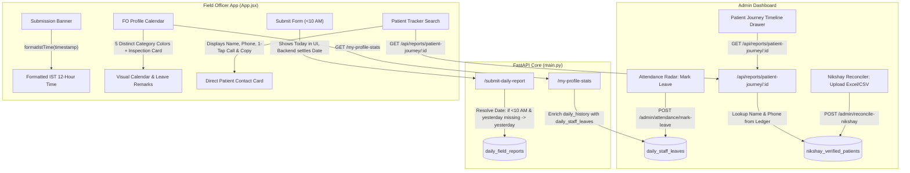

# Technical Design Specification: Cross-Portal Leave Sync, Stealth 10 AM Reporting Cutoff, Reconciler Patient Contacts & Submission Time Fix

- **Date:** 2026-09-25
- **Status:** Approved
- **Scope:** Full-stack (Backend FastAPI + Frontend React 19 + Firestore Collections)

---

## 1. Problem Statement & User Drivers

1. **Submission Confirmation Timestamp Bug**:
   - In the FO App post-submission banner, the time is extracted using `String(timestamp_completed).substring(11, 16)`.
   - When a local string like `"08:30 pm"` is provided, substring returns `""` falling back to `'Done'`.
   - When UTC ISO strings from Firestore are provided, it extracts UTC hours instead of converting to Indian Standard Time (IST), resulting in a 5h 30m display error.

2. **Cross-Portal Leave Synchronization & Calendar UX**:
   - Admins regularly mark staff leaves (Medical, Casual/Annual, Official Duty, Absent, Weekly Off) in the Attendance Radar (`daily_staff_leaves` collection).
   - Currently, the Field Officer profile calendar only highlights dates where `daily_field_reports` exist (green).
   - FOs cannot see leaves on their calendar, and selecting an approved leave date shows an alarming message: *"No report submitted on this date"*.
   - Need distinct color-coding per leave category on the calendar and a dedicated inspection card below showing the Admin's remark, leave reason, and marked-by metadata.

3. **Next-Day 10:00 AM Reporting Cutoff (Approach B: Stealth Resolution)**:
   - FOs frequently return from remote villages late at night without cellular network, submit reports early the next morning (e.g. 7:00 AM – 9:30 AM), and are penalized as defaulters for yesterday.
   - Per management directive, this must be a **backend-only stealth resolution** so FOs still see "Today" in the UI and do not exploit a visible grace period.
   - If a submission arrives before 10:00 AM IST and yesterday's report is pending, the backend silently maps the report to yesterday (`date_of_reporting = yesterday`), clearing yesterday's attendance and targets. Submissions at or after 10:00 AM IST strictly map to today.

4. **Nikshay Reconciler Patient Contact Persistence & Direct Dial**:
   - Currently, the Reconciler parses indicators (HIV/DM, DBT, UDST, CT) and writes to `nikshay_verified_patients`, but patient phone numbers and names are not exposed in the Patient Journey or FO Tracker result cards.
   - When the official Nikshay portal is slow or down, staff in the field cannot contact patients.
   - Reconciler Excel ingestion must reliably parse all variations of patient name and phone columns, persist them to `nikshay_verified_patients`, return them in `/api/reports/patient-journey/{patient_id}`, and provide 1-tap `📞 Call Patient` (`tel:`) and copy buttons in both FO App and Admin Dashboard.

---

## 2. Architecture & Data Flow



---

## 3. Detailed Component Specifications

### 3.1 Form Submission Time Formatter (`formatIstTime`)
- **Location:** `dfy-frontend/src/utils/timeFormat.js` or helper in `dfy-frontend/src/App.jsx`.
- **Specification:**
  ```javascript
  export const formatIstTime = (rawTs) => {
    if (!rawTs) return '';
    try {
      // Handles already formatted 12h strings like "08:30 pm"
      if (typeof rawTs === 'string' && /^\d{1,2}:\d{2}\s*(am|pm)$/i.test(rawTs.trim())) {
        return rawTs.trim().toUpperCase();
      }
      const d = new Date(rawTs);
      if (isNaN(d.getTime())) return String(rawTs);
      return d.toLocaleTimeString('en-IN', {
        timeZone: 'Asia/Kolkata',
        hour: '2-digit',
        minute: '2-digit',
        hour12: true
      });
    } catch {
      return String(rawTs);
    }
  };
  ```
- **Replacement in `dfy-frontend/src/App.jsx`**:
  Line 5058:
  ```jsx
  {todaySubmittedReport.timestamp_completed && (
    <span className="text-[10px] font-bold text-emerald-700 bg-emerald-100/70 px-2.5 py-1 rounded-lg shrink-0">
      {formatIstTime(todaySubmittedReport.timestamp_completed)}
    </span>
  )}
  ```

---

### 3.2 Stealth Backend 10:00 AM Reporting Cutoff Engine
- **Location:** `main.py`
- **Helper Function:**
  ```python
  async def resolve_effective_reporting_date(fo_name: str, working_place: str, requested_date: Optional[str] = None) -> str:
      """
      Stealth Grace Period Resolution:
      If submission arrives before 10:00 AM IST (now_ist.hour < 10):
        Check if FO's report for yesterday is missing in Firestore.
        If missing: assign date_of_reporting = yesterday.
        If already submitted or now_ist.hour >= 10: assign date_of_reporting = today.
      """
      now_ist = get_ist_now()
      today_str = now_ist.strftime("%Y-%m-%d")
      yesterday_str = (now_ist - timedelta(days=1)).strftime("%Y-%m-%d")
      
      # If explicit past date is requested (e.g. from admin editing or specific backfill), respect it
      if requested_date and requested_date < yesterday_str:
          return requested_date
          
      if now_ist.hour < 10:
          c_wp = canonicalize_district(working_place) if working_place else ""
          yesterday_doc_id = f"{c_wp}_{fo_name}_{yesterday_str}".replace(" ", "_").lower()
          doc_ref = db.collection("daily_field_reports").document(yesterday_doc_id)
          doc = await asyncio.to_thread(doc_ref.get)
          if not doc.exists:
              return yesterday_str
              
      return requested_date or today_str
  ```
- **Integration Points:**
  - `POST /submit-daily-report`: Uses `resolve_effective_reporting_date` before building `doc_id`.
  - `POST /check-today-status`: If `now_ist.hour < 10`, checks both today and yesterday status so the form stays responsive.

---

### 3.3 Cross-Portal Leave Synchronization & FO Calendar UX
- **Location:** `main.py` (`/my-profile-stats`), `dfy-frontend/src/App.jsx`
- **Backend (`my-profile-stats`):**
  - Query `daily_staff_leaves` for `clean_fo` and `clean_dist` where `date >= f"{req_month}-01"` and `<= f"{req_month}-31"`.
  - Merge into `daily_history[date_str]`:
    ```python
    daily_history[date_str] = {
        "submitted": False,
        "is_leave": True,
        "status": leave_doc.get("status", "leave"),
        "reason_type": leave_doc.get("reason_type", "Casual"),
        "remark": leave_doc.get("remark", ""),
        "marked_by": leave_doc.get("marked_by_name", "Admin"),
        "marked_at": leave_doc.get("marked_at", "")
    }
    ```
- **Frontend Calendar Color Matrix (`App.jsx`):**
  - 🟢 **Report Submitted (`count > 0`):** `bg-emerald-500 text-white font-black shadow-sm border-emerald-600`
  - 🟡 **Sick / Medical Leave:** `bg-amber-500 text-white font-black shadow-sm border-amber-600`
  - 🔵 **Annual / Casual Leave:** `bg-sky-500 text-white font-black shadow-sm border-sky-600`
  - 🟣 **Official Duty / Training:** `bg-indigo-500 text-white font-black shadow-sm border-indigo-600`
  - 🔴 **Absent / Uninformed:** `bg-rose-500 text-white font-black shadow-sm border-rose-600`
  - ⚪ **Weekly Off:** `bg-slate-400 text-white font-black shadow-sm border-slate-500`
  - ⬜ **No Report:** `bg-slate-50 text-slate-400 border-slate-100`
- **Inspection Card (Below Calendar):**
  - If `selectedDayData?.is_leave`: Render a dedicated card with badge, reason type, marked-by name, and quote box containing the Admin's remark.

---

### 3.4 Nikshay Reconciler Patient Contacts & Direct Dial
- **Location:** `main.py` (`reconcile_nikshay`, `sync_nikshay_cumulative_ledger_sync`, `/api/reports/patient-journey/{patient_id}`), `dfy-frontend/src/App.jsx`, `dfy-frontend/src/AdminDashboard.jsx`.
- **Backend Persistence:**
  - Expand phone column matching in `reconcile_nikshay`:
    `["primaryphone", "phone", "mobile", "mobile_no", "mobile_number", "contact_no", "contact_number", "beneficiary_mobile", "patient_mobile", "phone_number", "cell"]`.
  - Expand name column matching:
    `["patient_name", "patientname", "name", "beneficiary_name", "case_name", "patient"]`.
  - Sanitize phone numbers to remove decimals (e.g. `9876543210.0` -> `9876543210`).
  - In `sync_nikshay_cumulative_ledger_sync`, ensure `patient_name` and `phone` are updated whenever provided.
  - In `/api/reports/patient-journey/{patient_id}`, attach `patient_name` and `phone` to `res["metadata"]`.
- **Frontend Contact Card (`PatientJourneyTracker` & `AdminDashboard.jsx`):**
  - Render Patient Name prominently: `Ramesh Kumar`.
  - Render Mobile Number: `9876543210` with:
    - 🟢 `📞 Call Patient` link: `<a href="tel:9876543210" className="...">Call Patient</a>`
    - 📋 `Copy` button: Copies number to clipboard with feedback toast.

---

## 4. Verification Battery & Testing Strategy

1. **Unit & Integration Tests**:
   - `tests/test_stealth_10am_cutoff.py`: Simulates submissions before 10 AM (hour=8) vs after 10 AM (hour=14), asserting date resolution to yesterday vs today.
   - `tests/test_fo_leave_sync_and_calendar.py`: Tests `/my-profile-stats` leave hydration, verifies leave metadata presence in `daily_history`.
   - `tests/test_reconciler_patient_contacts.py`: Tests Excel parsing of phone/name variants, persistence to `nikshay_verified_patients`, and journey endpoint metadata output.
   - `tests/test_submission_time_format.mjs`: Tests `formatIstTime` with UTC ISO, 12h strings, timestamps, and invalid inputs.
2. **Regression Battery**:
   - `python -m py_compile main.py` (Exit code 0)
   - `pytest tests/ -k "not mjs"` (All 45+ tests pass)
   - `npm --prefix dfy-frontend run lint` (0 syntax errors)
   - `npm --prefix dfy-frontend run build` (Exit code 0)
   - All Node test suites pass (100%)
3. **GEMINI.md Rule 1 & Rule 5**:
   - No forward references or TDZ issues.
   - Local local-only commits first, full evidence summary presented, explicit user approval required before push.
