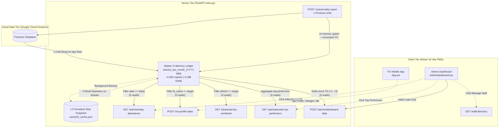

# Architectural Design Spec: Firestore Read Reduction & Lazy Tab Delta Sync Engine

**Project:** DFY TB MIS Field Reporting App (Bihar State Operations)  
**Date:** September 30, 2026  
**Status:** Approved by User — Ready for Implementation Planning  
**Target:** Slash daily billable Firestore reads from ~673,000 to <20,000/day (100% Free Tier, ₹0.00/day bill) while accelerating UI response times to <100ms.

---

## 1. Executive Summary & Problem Statement

### 1.1 The Anomaly
On September 29, 2026, the Google Cloud Firestore daily bill reached **₹31.22**, translating to **~673,100 document reads in a single 24-hour period**. For an active staff size of ~160 Field Officers and ~15 Supervisors generating ~4,000 monthly reports across Bihar, this read volume represents an **excess read multiplier of over 30x**.

On Sunday, September 27 (a weekly off-day with zero field operations), reads spiked to **473,700 reads (₹21.23)**, proving that read costs were being driven by client-side polling waterfalls, short-lived cache TTLs, and cache eviction cascades rather than genuine user reporting.

### 1.2 Core Objective
1. **Reduce Daily Firestore Reads by >96%:** Bring total daily reads well below Firestore's **50,000 Free Tier quota**, reducing daily billing to **₹0.00**.
2. **Preserve Snappy User Experience:** Retain sub-100ms instant rendering via in-memory caching and real-time delta updates (+1, +3, +20 records) without white screens or full-table reloads.
3. **Zero Data Desync:** Derive all views (Master Table, Attendance Radar, Profile Badges, KPI Workbooks, Leaderboard) from a single shared in-memory ledger.
4. **Strict Isolation & Privacy:** Maintain Sub-Admin district RBAC and preserve the confidential Stealth 10:00 AM next-day reporting cutoff.

---

## 2. Root-Cause Analysis of Current Read Leaks

The architectural audit uncovered 5 critical leakage points in `main.py`, `AdminDashboard.jsx`, and `App.jsx`:

| Leak ID | Component & File Location | Mechanism of Leakage | Daily Read Impact |
| :--- | :--- | :--- | :--- |
| **L-01** | `/my-profile-stats`<br>[`main.py:3213-3560`](file:///d:/ignou/Mis%20field%20report/main.py#L3213-L3560) | **20-second TTL + Global Eviction Cascade:**<br>1) `cache.set(cache_key, res, ttl=20)` expires in 20 seconds.<br>2) `submit_daily_report` runs `cache.delete_prefix("profile_")`, wiping all 160 officer profiles on every single submission across Bihar.<br>3) Every profile check queries `daily_field_reports` stream, `daily_staff_leaves` stream, and sequential PIN/target `.get()` calls (30-50 reads per profile open). | **100,000 – 150,000 reads/day** |
| **L-02** | `/api/district-notification-registry`<br>[`main.py:1815-1857`](file:///d:/ignou/Mis%20field%20report/main.py#L1815-L1857) | **90-Day Full District Stream on Every Submit:**<br>1) Report submission evicts `dist_notif_registry_{district}_`.<br>2) `App.jsx:6396` immediately calls `fetchAndStoreDistrictRegistry`.<br>3) Backend streams all reports from the last 90 days for that district (300-500 documents per submission). | **50,000 – 75,000 reads/day** |
| **L-03** | `/admin/today-attendance`<br>[`main.py:3568-3968`](file:///d:/ignou/Mis%20field%20report/main.py#L3568-L3968) | **60-second TTL + Submission Wipes:**<br>1) Cached for only 60 seconds (`ttl=60`).<br>2) Wiped on every report submission via `cache.delete_prefix("attendance_")`.<br>3) Each fetch streams `target_date` reports, `next_date` morning cutoff reports, and `daily_staff_leaves` (~200 reads per call). | **80,000 – 120,000 reads/day** |
| **L-04** | KPI Excel Engine<br>[`main.py:2496, 2524-2528`](file:///d:/ignou/Mis%20field%20report/main.py#L2496) | **Direct Firestore Streams Bypassing Cache:**<br>`generate_district_kpi_bytes` streams `staff_targets` and `daily_field_reports` directly from Firestore across multiple alias queries instead of reading from the existing in-memory monthly cache (~4,400 reads per 22-district zip download). | **10,000 – 40,000 reads/day** |
| **L-05** | Dashboard Waterfall<br>[`AdminDashboard.jsx:3354`](file:///d:/ignou/Mis%20field%20report/dfy-frontend/src/AdminDashboard.jsx#L3354) | **Monolithic Initial Eager Waterfall:**<br>Initial mount fires 8 parallel requests (`fetchData`, `fetchAttendance`, `fetchDirectory`, `loadTargets`, `fetchStaffList`, `fetchActiveBroadcasts`, `fetchTopPerformers`, `fetchPacingSettings`), pulling heavy studios even when the admin only checks one table. | **50,000 – 80,000 reads/day** |

---

## 3. High-Level Architecture: Single Ledger + On-Demand Tabs



---

## 4. Backend Implementation Specifications

### 4.1 Master Ledger Derivation Engine

#### 4.1.1 Attendance Radar Derivation (`get_today_attendance`)
Instead of streaming `daily_field_reports` for `target_date` and `next_date`, `get_today_attendance` will:
1. Parse `target_date` and `target_month` (`target_month = target_date[:7]`).
2. **Month-End Boundary Transition Guard (Loophole 2 Fix):**
   - Submissions on Day 1 or Day 2 of a month before the stealth cutoff hour belong to the last day of the previous month.
   - Similarly, Day 28+ reports can be submitted on Day 1 of the next month.
   - To guarantee zero missed morning submissions across month boundaries:
     ```python
     raw_docs = list(await get_raw_monthly_reports(target_month))
     target_dt = datetime.strptime(target_date, "%Y-%m-%d").date()
     prev_month_str = (target_dt.replace(day=1) - timedelta(days=1)).strftime("%Y-%m")
     next_month_str = (target_dt.replace(day=28) + timedelta(days=4)).strftime("%Y-%m")

     if target_dt.day <= 2:
         prev_docs = await get_raw_monthly_reports(prev_month_str)
         raw_docs.extend(prev_docs)
     elif target_dt.day >= 28:
         next_docs = await get_raw_monthly_reports(next_month_str)
         raw_docs.extend(next_docs)
     ```
3. Filter records entirely in-memory:
   - Identify candidate reports where `date_of_reporting == target_date` or `date_of_reporting == next_date`.
   - Apply Stealth Cutoff rules:
     - If submitted on `target_date` before cutoff hour (11 AM), exclude (belongs to `target_date - 1`).
     - If submitted on `next_date` before cutoff hour (or marked `is_next_day_submission`), include as morning submission for `target_date`.
4. Read `daily_staff_leaves` with a date-bounded query or from an in-memory leave cache (`leaves_{clean_month}`).
5. Map officers against `get_cached_staff_directory_raw()`.
6. **Sub-Admin RBAC Cache Collision Guard (Loophole 3 Fix):**
   - To prevent cache poisoning or unauthorized data leakage between Super Admin and Sub-Admin queries, bind user role and ID into the cache key:
     ```python
     user_scope = "super" if admin.get("role") == "SUPER_ADMIN" else f"sub_{admin.get('user_id') or admin.get('username')}"
     cache_key = f"attendance_{target_date}_{effective_dist}_{user_scope}"
     ```
   - Enforce strict Sub-Admin in-memory district boundary filtering before returning `res`.
7. Cache the final result with `ttl=600` (10 minutes instead of 60 seconds).
8. **Firestore Reads per Call: 0.**

#### 4.1.2 FO Profile Stats Derivation (`my_profile_stats`)
1. **Target and PIN Lookups:**
   - Replace candidate loop `.document().get()` with `get_cached_staff_directory_raw()` to verify PINs in 0ms without hitting Firestore.
   - Replace target `.document().get()` with `get_cached_staff_targets_for_month(req_month)`.
2. **Monthly Daily History:**
   - Pull from `raw_docs = await get_raw_monthly_reports(req_month)`.
   - Filter records matching `r["fo_name"] == req.fo_name` and canonical district.
   - Calculate streaks, badges, KM, and categories directly from in-memory objects.
3. **Scoped Eviction Policy:**
   - In `submit_daily_report`, remove `cache.delete_prefix("profile_")`.
   - Replace with targeted single-officer eviction:
     ```python
     clean_wp = canonicalize_district(report.working_place).replace(" ", "_").lower()
     clean_fo = re.sub(r'[^a-zA-Z0-9]', '', report.fo_name).lower()
     month_str = report.date_of_reporting[:7]
     cache.delete(f"profile_{clean_wp}_{clean_fo}_{month_str}")
     ```
   - All other 159 officers retain their cached profiles!
4. **Cache TTL:** Bump `cache.set(cache_key, res, ttl=1800)` (30 minutes instead of 20 seconds).
5. **Firestore Reads per Call: 0.**

#### 4.1.3 KPI Excel Generator (`generate_district_kpi_bytes`)
1. Replace direct queries on `staff_targets` and `daily_field_reports` with:
   ```python
   raw_reports = await get_raw_monthly_reports(month_prefix)
   target_records = await get_cached_staff_targets_for_month(month_prefix)
   ```
2. Filter `raw_reports` in memory by district and aliases (`AURANGABAD-BI`, `Purba Champaran`, etc.).
3. Populate performance, consolidated, and daily sheets using existing logic.
4. **Firestore Reads per Bulk Zip Generation: 0 (reduced from 4,400).**

#### 4.1.4 In-Place Notification Registry Append & Warm-up Fallback (Loophole 1 Fix)
1. In `submit_daily_report`, do NOT delete `dist_notif_registry_{clean_dist}_`.
2. **Empty Cache Trap Defense:**
   - If container restart or TTL expiry occurred, `cache.get(reg_cache_key)` returns `None`.
   - Guard against silent ID dropping by fetching/caching a fresh snapshot before appending:
     ```python
     reg_cache_key = f"dist_notif_registry_{clean_wp}_{cur_month_str}_3"
     cached_reg = cache.get(reg_cache_key)
     if cached_reg is None or not isinstance(cached_reg, dict) or "registry" not in cached_reg:
         # Cache miss fallback: Cold fetch to warm up registry cache
         cached_reg = await fetch_district_notification_registry(clean_wp, months=3)

     if cached_reg and isinstance(cached_reg, dict) and "registry" in cached_reg:
         for nid in valid_new_notifs:
             cached_reg["registry"][nid] = {
                 "date": report.date_of_reporting,
                 "fo_name": report.fo_name,
                 "doc_id": doc_id
             }
         cached_reg["total_count"] = len(cached_reg["registry"])
         cache.set(reg_cache_key, cached_reg, ttl=7200)
     ```
3. Avoid triggering the 90-day 500-doc Firestore scan on every submit.
4. **Firestore Reads per Submit: 0 (reduced from 400).**

---

## 5. Frontend Implementation Specifications

### 5.1 On-Demand Lazy Tab Loading (`AdminDashboard.jsx`) & TDZ Order Safety (Loophole 4 Fix)

#### 5.1.1 Temporal Dead Zone (TDZ) Lexical Architecture
To prevent runtime crashes (`ReferenceError: Cannot access 'fetchAttendance' before initialization`):
1. **Tier 1:** Base state declarations (`useState`, `useRef`).
2. **Tier 2:** Derived state collections (`useMemo`).
3. **Tier 3:** Helper functions and data fetchers (`useCallback` for `fetchData`, `fetchAttendance`, `loadTargets`, `fetchTopPerformers`, etc.).
4. **Tier 4:** Tab and modal trigger `useEffect` hooks declared **strictly after** the fetchers they invoke!

#### 5.1.2 Main Mount Optimization
In `AdminDashboard.jsx`, the primary `useEffect` will be restricted to:
```javascript
// Clean Initial Mount: ONLY core data and directory lookup
useEffect(() => {
  if (isAuthenticated) {
    fetchData(false);        // Core table (Delta Sync enabled)
    fetchDirectory();        // Lightweight staff dropdown names
    fetchActiveBroadcasts(); // Urgent alerts
  }
}, [month, isAuthenticated]);
```
Remove `fetchAttendance()`, `loadTargets('All')`, `fetchStaffList()`, `fetchTopPerformers()`, and `fetchPacingSettings()` from eager mount!

#### 5.1.3 Tab / Modal Triggers (Declared after fetchers)
1. **Attendance Radar:**
   ```javascript
   useEffect(() => {
     if (showAttendanceModal && !attendanceData) {
       fetchAttendance();
     }
   }, [showAttendanceModal]);
   ```
2. **Top Performers Studio:**
   ```javascript
   useEffect(() => {
     if (activeTab === 'leaderboard' || showTopPerformersModal) {
       if (!topPerformersData || topPerformersPeriodChanged) {
         fetchTopPerformers(topPerformersPeriod);
       }
     }
   }, [activeTab, showTopPerformersModal, topPerformersPeriod]);
   ```
3. **Staff Management & Targets:**
   ```javascript
   useEffect(() => {
     if ((showStaffModal || showTargetModal) && !targetsData) {
       loadTargets('All');
       fetchStaffList();
     }
   }, [showStaffModal, showTargetModal]);
   ```
4. **Pacing Settings:**
   ```javascript
   useEffect(() => {
     if (showPacingModal) {
       fetchPacingSettings(month, selectedDistrict);
     }
   }, [showPacingModal, selectedDistrict, month]);
   ```

### 5.2 Real-Time Delta Sync Engine (+1, +3, +20) & Deletion Sync (Loophole 5 Fix)

#### 5.2.1 Client Delta State Management with Tombstone Deletions
When `fetchData(false, true)` runs on the 60s background interval or window focus:
1. Send `{ month_prefix: month, since: lastSyncedTime, cached_count: rawRecords.length }`.
2. Backend returns `deleted_ids` alongside new records:
   ```python
   return {
       "status": "success",
       "mode": "DELTA",
       "synced_at": last_mut_str,
       "records": delta_records,
       "deleted_ids": recent_deletions
   }
   ```
3. Frontend delta merge logic updates both deletions and upserts:
   ```javascript
   setRawRecords(prev => {
     const currentList = (prev && prev.length > 0) ? prev : (cachedData?.records || []);
     const recordMap = new Map(currentList.map(r => [r.id || r.doc_id, r]));

     // 1. Remove deleted items
     if (Array.isArray(data.deleted_ids)) {
       data.deleted_ids.forEach(delId => recordMap.delete(delId));
     }

     // 2. Upsert updated / new items
     if (Array.isArray(data.records)) {
       data.records.forEach(newRec => {
         const id = newRec.id || newRec.doc_id;
         if (id) recordMap.set(id, newRec);
       });
     }

     const updated = Array.from(recordMap.values());
     return updated;
   });
   ```

#### 5.2.2 Visibility Guard
```javascript
const intervalId = setInterval(() => {
  if (document.hidden) return; // Do not poll if user switched to another tab
  fetchData(false, true);
}, 60000);
```

### 5.3 Frontline Field Officer App (`App.jsx`)
1. On initial login or session restore:
   - Check if `formData` is restored.
   - Do NOT immediately invoke `fetchFoMonthlyHistory` (`/my-profile-stats`).
2. Only call `fetchFoMonthlyHistory` when the user taps the **"My Profile / Badges"** button or opens the Achievement Studio modal.
3. Cache the response in component state for the duration of the app session.

---

## 6. Security, RBAC & Stealth Boundaries

1. **Sub-Admin District Enclosure:**
   - In `get_today_attendance`, `get_raw_monthly_reports`, and `export_state_summary`, any query initiated by a Sub-Admin must filter the in-memory master ledger strictly by `admin["allowed_districts"]`.
   - Sub-admins cannot view or derive records outside their assigned districts.
2. **Stealth 10 AM Cutoff Integrity:**
   - In-memory attendance derivation must calculate the cutoff hour dynamically (`get_reporting_cutoff_hour(dt_ist)`).
   - Zero leak of cutoff hours or internal next-day logic to the FO client interface.
3. **Anti-OOM Protection:**
   - Master ledger storage in FastAPI RAM is ~6 MB for 4,000 monthly reports.
   - Explicit `del wb; gc.collect()` preserved in Excel/ZIP generation routines.

---

## 7. Test Strategy & Verification Protocol

### 7.1 Backend Automated Tests (Pytest)
1. `tests/test_master_ledger_derivation.py`:
   - Assert `get_today_attendance` returns identical results from in-memory ledger as direct query.
   - Assert `my_profile_stats` computes accurate 17-indicator counts, streaks, and badges from in-memory ledger.
   - Assert `generate_district_kpi_bytes` produces valid Excel bytes matching template column layouts without calling `db.collection().stream()`.
2. `tests/test_notification_registry_append.py`:
   - Assert submitting a report appends newly generated IDs to the in-memory registry without streaming Firestore.
3. `tests/test_scoped_profile_invalidation.py`:
   - Assert `submit_daily_report` invalidates only the submitting officer's profile key, keeping other officers cached.

### 7.2 Frontend Automated Tests (Node / React)
1. `tests/test_lazy_tab_loading_ui.mjs`:
   - Assert initial mount does NOT trigger `fetchAttendance`, `fetchTopPerformers`, or `loadTargets`.
   - Assert opening the Attendance modal triggers `fetchAttendance`.
   - Assert opening the Top Performers Studio triggers `fetchTopPerformers`.
2. `tests/test_delta_merge.mjs`:
   - Assert `mode === 'NO_CHANGE'` preserves existing record references.
   - Assert `mode === 'DELTA'` updates modified records and appends new ones.

### 7.3 Production Build & Quality Gates
- `python -m py_compile main.py` exit code 0.
- `npm --prefix dfy-frontend run lint` with 0 syntax errors.
- `npm --prefix dfy-frontend run build` with exit code 0.
- Temporal Dead Zone (TDZ) lexical scope check in `AdminDashboard.jsx`.
- Strict local commit; push only after explicit user approval.
