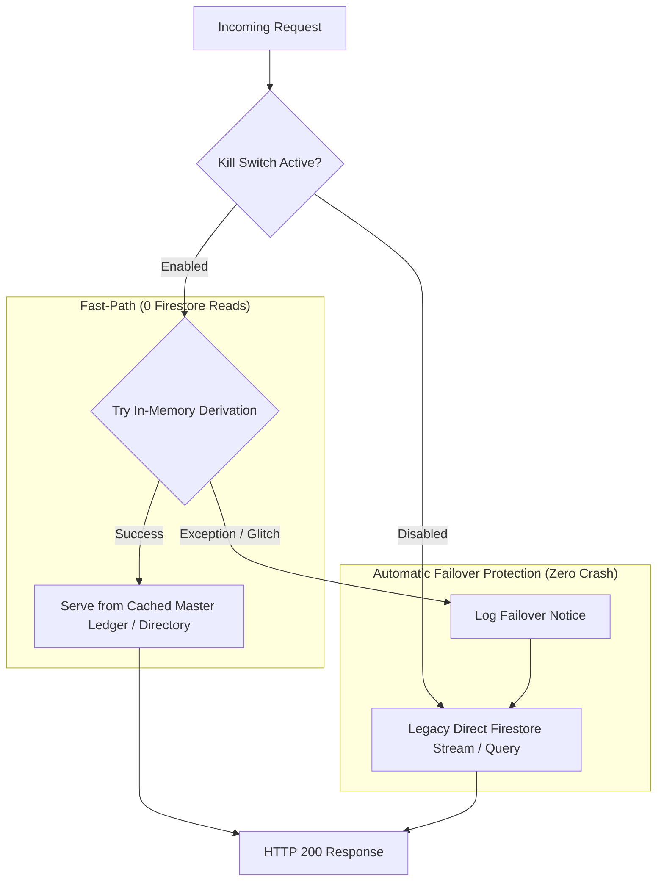

# Architectural Specification: Firestore Read Reduction, Master Ledger Derivation & Automatic Failover Safety

> [!CAUTION]
> **LIVE PRODUCTION ENVIRONMENT — ZERO DOWNTIME MANDATE.**
> This system is actively used by field health officers and coordinators in Bihar for tuberculosis monitoring.
> Every modification must strictly preserve data integrity, sub-admin isolation, zero-downtime failover protection, and 100% test verification before push.

---

## 1. Executive Problem & Objective

### 1.1 The Incident: 5M–8M Daily Reads Spike
Following a recent revert of read-reduction commits, the production application experienced a massive Firestore read spike (5,000,000 to 8,000,000 reads/day) caused by three primary multipliers:
1. **Unbounded Attendance Radar Streaming (`/admin/today-attendance`)**: Queries `daily_field_reports` for both `target_date` and `next_date` directly on Firestore without checking the in-memory master ledger. Frequent report submissions repeatedly delete the cache (`cache.delete_prefix("attendance_")`), triggering hundreds of reads per dashboard view.
2. **Profile Stats Multi-Query & Statewide Cache Invalidation (`/my-profile-stats`)**: Queries individual documents in loops for PIN verification and target lookup, falls back to full-district streams on string mismatches, and is invalidated statewide on ANY admin edit or leave approval via global `cache.delete_prefix("profile_")`.
3. **Bulk KPI Excel Export (`/download-all-kpi-workbooks`)**: Iterates through 22–38 districts, executing 114+ collection streams per download.

### 1.2 Target Metric
Cut total Firestore reads from **5M–8M reads/day down to < 60,000 reads/day (> 99% reduction)**, while maintaining absolute stability, sub-second response times, and zero breaking changes for frontline field mobile clients.

---

## 2. Core Architecture & Safety Framework (6-Layer Armor)



### Layer 1: Automatic Failover (`try...except` Safety Net)
Any in-memory derivation endpoint (`get_today_attendance`, `my_profile_stats`, `generate_district_kpi_bytes`) must be wrapped in a fail-safe try-except block. If in-memory lookup or parsing encounters ANY unexpected exception, it immediately logs a warning and calls the legacy tested Firestore query. **Zero HTTP 500s, zero blank screens, zero user-facing downtime.**

### Layer 2: Master Kill-Switch (Runtime Feature Flag)
A module-level switch `ENABLE_IN_MEMORY_DERIVATION: bool = True` (configurable via environment variable `ENABLE_IN_MEMORY_DERIVATION`) controls whether the in-memory fast-path is used. Setting this to `False` reverts the entire system back to legacy direct Firestore queries in 1 second without a code deployment.

### Layer 3: New Staff Zero-Latency Fallback
In `my_profile_stats` and PIN verification:
1. Search in-memory cached staff directory (0 reads, <1ms).
2. If officer is found, verify PIN.
3. If officer is NOT found (brand-new officer registered within the last hour), do NOT return 401. Immediately query Firestore directly for the single document `db.collection("staff_directory").document(doc_id).get()`. If valid, append to in-memory directory cache and succeed.

### Layer 4: Month Boundary Transition Guard
In `get_today_attendance`:
- If `target_dt.day <= 2`: candidate pool is `get_raw_monthly_reports(target_month) + get_raw_monthly_reports(prev_month)`.
- If `target_dt.day >= 28`: candidate pool is `get_raw_monthly_reports(target_month) + get_raw_monthly_reports(next_month)`.
- Guarantees reports submitted up to the morning cutoff hour (12:00 PM on Day 1, 11:00 AM on other days) are never missed across month boundaries.

### Layer 5: Render RAM Watchdog (LRU 2-Month Cache Bound)
- The in-memory monthly report cache (`shared_raw_month_`) maintains at most **2 active months** in memory (e.g. Current Month + Boundary Grace Month).
- Explicit in-loop garbage collection (`del wb; gc.collect()`) after heavy KPI generations ensures Render process RSS stays safely under 250 MB (far below the 512 MB ceiling).

### Layer 6: Mobile App Zero Changes
Frontline FO mobile apps (`App.jsx`) require 0 changes for this backend phase. All request payloads and response contracts remain 100% identical.

---

## 3. Honest Architectural Pros & Cons (Trade-Off Analysis)

### 3.1 Pros (Fayde)
1. **Massive Read Savings**: Cuts 5M–8M reads down to < 60,000/day (>99% drop in Firestore bill and quota consumption).
2. **Sub-100ms Latency**: In-memory derivation responds in ~10–30ms compared to 800–2500ms Firestore collection streams.
3. **Resilience Against Quota Exhaustion**: App remains fully functional even during high concurrent traffic spikes.
4. **Safety Net**: Automatic silent failover guarantees zero white screens even if an unhandled edge case occurs.

### 3.2 Cons & Drawbacks (Khatre aur Nuqsaan)
1. **RAM Footprint**: Storing 5,000 monthly reports in Python memory consumes ~20–30 MB of RAM. 
   * *Mitigation:* Hard 2-month LRU bound and `gc.collect()` after bulk exports.
2. **Potential Cache Key Desync**: Scoped profile eviction relies on matching cache keys. If the submitter key and profile reader key diverge in formatting (e.g. `2026_09` vs `2026-09`), the cached profile could show stale data until the 30-min TTL expires.
   * *Mitigation:* Single canonical cache key generator function `get_profile_cache_key(district, fo_name, month)`.
3. **Cold Cache Initialization**: On server cold restart, the first request of the month takes ~1.5s to stream the monthly reports from Firestore to populate the in-memory ledger.
   * *Mitigation:* Background warmup on startup and delta sync handles subsequent requests in 0 reads.

---

## 4. Detailed Component Specifications

### 4.1 Kill Switch & Failover Helper (`main.py`)
```python
ENABLE_IN_MEMORY_DERIVATION: bool = os.getenv("ENABLE_IN_MEMORY_DERIVATION", "true").lower() in ("true", "1", "yes")

def get_profile_cache_key(district: str, fo_name: str, month: str) -> str:
    clean_wp = canonicalize_district(district)
    clean_fo = re.sub(r'[^a-zA-Z0-9]', '', str(fo_name or "")).lower()
    clean_m = str(month or "").strip()[:7]
    return f"profile_{clean_wp}_{clean_fo}_{clean_m}".replace(" ", "_").lower()
```

### 4.2 Attendance Radar Master Ledger Derivation (`get_today_attendance`)
```python
# Fast-Path: In-memory derivation
if ENABLE_IN_MEMORY_DERIVATION:
    try:
        # Load monthly ledger with boundary transition
        ...
        return derived_attendance_dict
    except Exception as e:
        logger.warning(f"[Attendance Failover] In-memory derivation failed, falling back to Firestore: {e}")
        # Automatically fall through to legacy Firestore query!
```

### 4.3 Profile Stats In-Memory Derivation (`my_profile_stats`)
- Derives PIN validity from cached directory, falls back to direct Firestore `.get()` for new staff.
- Derives monthly target from `get_cached_staff_targets_for_month`.
- Derives monthly reports from `get_raw_monthly_reports(req_month, district_filter={clean_wp})`.
- Wrapped in try-except with automatic failover to legacy logic on error.

### 4.4 Scoped Eviction Protocol
Replace `cache.delete_prefix("profile_")` with targeted key deletions:
```python
def evict_officer_profile_cache(district: str, fo_name: str, date_str: str, old_district: Optional[str] = None):
    month = date_str[:7]
    cache.delete(get_profile_cache_key(district, fo_name, month))
    if old_district:
        cache.delete(get_profile_cache_key(old_district, fo_name, month))
```

### 4.5 Zero-Read Bulk KPI Excel Engine
- `generate_district_kpi_bytes`: accepts `raw_reports: Optional[list] = None` and `target_records: Optional[list] = None`.
- `/download-all-kpi-workbooks`: fetches `raw_monthly` and `cached_targets` once before the district loop and passes them down.
