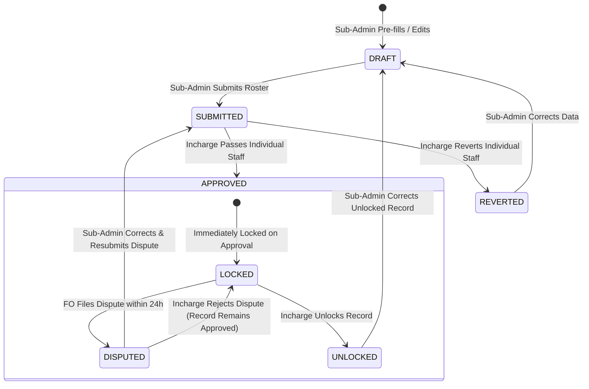

# Design Specification: Modular Travel Allowance (TA) & Bike Log Subsystem

- **Date:** 2026-10-02
- **Branch:** `feat/travel-allowance-modular` (Clean isolation from `main`)
- **Status:** DRAFT / UNDER REVIEW
- **Author:** DFY Engineering & Healthcare Operations Team

---

## 1. Executive Summary & Core Objectives

In the Bihar TB Elimination Mission operated by Doctors For You (DFY), Field Officers (FO) travel extensively across blocks, primary health centers (PHC), private practitioner clinics, and diagnostic centers on motorbikes.

This specification defines the complete, production-grade integration of the **Travel Allowance (TA) & Bike Log Management Subsystem** into the newly decomposed, modular DFY MIS application (FastAPI + Firestore + React 19).

### Key Architectural & Operational Objectives:
1. **Clean Modular Decomposition (Zero Monolith Bloat)**:
   - Dedicated backend router: `backend/routers/travel_allowance.py` mounted cleanly in `main.py`.
   - Dedicated frontend modal: `dfy-frontend/src/components/Admin/modals/TravelAllowanceModal.jsx` and hook `dfy-frontend/src/hooks/useAdminTA.js`.
   - Dedicated FO mobile card: `dfy-frontend/src/components/Fo/TravelAllowanceCard.jsx` embedded in `App.jsx`.
2. **Strict Multi-Tier Role Governance & Separation of Duties**:
   - **Sub-Admin (District Coordinator)**: Enters/edits meter readings, applies deductions, pre-fills from reports (via hidden context menu), and submits district roster to Incharge. Cannot directly edit locked/approved records without Incharge unlocking them.
   - **Main Incharge / Admin**: Strictly **Read-Only inspection** on draft data. Reviews submitted rosters, performs per-staff granular pass / revert, approves for payout, locks records, and holds sole authority to unlock finalized records for correction. Cannot directly edit readings.
   - **Super Admin**: Master governance, global override, and dynamic KM rate configuration.
   - **Field Officer (FO)**: Read-only monthly summary card on mobile app. Cannot view unapproved drafts. 24-hour dispute window activates upon approval.
3. **Per-Staff Granular Pass & Revert (Non-Blocking District Approval)**:
   - The Incharge can pass 4 of 5 staff members and revert 1 staff member with specific feedback. The 4 approved staff proceed toward payroll without being blocked by the 1 flagged record.
4. **Locking & Unlock Gate**:
   - Once marked `APPROVED` by the Incharge, the record is immediately **LOCKED**.
   - If a correction is needed, the Incharge must explicitly click **"Unlock Record"**; only then can the Sub-Admin edit and resubmit.
5. **Dual-Alert 24-Hour Dispute Workflow**:
   - When an FO raises a dispute within the 24-hour post-approval window, an alert notification is dispatched simultaneously to **both Sub-Admin and Incharge/Admin**.
   - Sub-Admin applies necessary corrections and resubmits to Incharge for final resolution (Approve or Reject with reason).
6. **Dynamic Global KM Rate (Configurable Price)**:
   - Default rate is ₹4.00/KM, stored centrally in `app_settings/travel_allowance`.
   - Super Admin or Incharge can update the rate (e.g. to ₹4.50 or ₹5.00), which instantly synchronizes across all calculations, FO app display, and Excel formulas.
7. **Hidden Pre-fill Action**:
   - The "Pre-fill District from Reports" action is strictly restricted to Sub-Admin/Admin and tucked into a discreet context menu (`•••`) to prevent accidental bulk overrides.
8. **Executive Multi-Sheet Excel Payroll Export (.xlsx)**:
   - Sheet 1: Master District Payroll Summary with `=SUM(...)` Excel formulas.
   - Sheets 2..N: Individual 31-day bike log sheets matching Bihar Health Mission standards.

---

## 2. User Roles & Permission Matrix

| Feature / Action | `SUPER_ADMIN` | `MAIN_INCHARGE` / `ADMIN` | `SUB_ADMIN` | `FIELD_OFFICER` |
| :--- | :---: | :---: | :---: | :---: |
| **Set Global KM Rate (`₹/KM`)** | ✅ Full | ✅ Full | ❌ None | ❌ None |
| **Inspect Draft Rosters** | ✅ Full | ✅ Read-Only | ✅ Allowed Districts | ❌ Hidden |
| **Pre-fill from Reports (Hidden Menu)** | ✅ Full | ❌ None | ✅ Allowed Districts | ❌ None |
| **Edit Meter Readings & Deductions** | ✅ Full | ❌ Read-Only (Cannot edit) | ✅ Allowed Districts (Drafts only) | ❌ None |
| **Submit Roster to Incharge** | ✅ Override | ❌ None | ✅ Allowed Districts | ❌ None |
| **Pass / Approve Individual Staff** | ✅ Full | ✅ Allowed Districts | ❌ None | ❌ None |
| **Revert Individual Staff with Remarks** | ✅ Full | ✅ Allowed Districts | ❌ None | ❌ None |
| **Lock Record upon Approval** | ✅ Auto | ✅ Auto | ❌ None | ❌ None |
| **Unlock Finalized Record for Correction**| ✅ Full | ✅ Allowed Districts | ❌ None | ❌ None |
| **View Approved TA Summary on Mobile** | ❌ N/A | ❌ N/A | ❌ N/A | ✅ Own Record |
| **Raise 24-Hour Dispute Claim** | ❌ N/A | ❌ N/A | ❌ N/A | ✅ Own Record (within 24h) |
| **Receive Dispute Alert Notification** | ✅ Full | ✅ Full | ✅ Allowed Districts | ❌ None |
| **Resolve Dispute (Approve / Reject)** | ✅ Full | ✅ Full | ❌ Submits fix only | ❌ None |
| **Export Multi-Sheet Payroll Excel** | ✅ Statewide | ✅ Statewide | ✅ Allowed Districts | ❌ None |

---

## 3. Data Model & Firestore Schema

### 3.1 Collection: `travel_allowance_logs`
- **Document ID Format:** `{year_month}_{district.lower()}_{staff_key}`  
  *(Example: `2026-09_gaya_ramesh_kumar`)*

```json
{
  "doc_id": "2026-09_gaya_ramesh_kumar",
  "month": "2026-09",
  "district": "Gaya",
  "staff_name": "Ramesh Kumar",
  "staff_key": "ramesh_kumar",
  "designation": "Field Officer",
  
  "rate_per_km": 4.00,
  "total_km": 420.5,
  "gross_amount": 1682.00,
  "deduction_amount": 82.00,
  "deduction_reason": "Excess personal detour on Sept 14",
  "final_payable_amount": 1600.00,
  "admin_remarks": "Verified against daily report register",
  
  "status": "DRAFT",
  "is_locked": false,
  
  "submitted_at": null,
  "submitted_by": null,
  "approved_at": null,
  "approved_by": null,
  "reverted_at": null,
  "reverted_by": null,
  "revert_reason": null,
  "unlocked_at": null,
  "unlocked_by": null,
  
  "dispute_status": "NONE",
  "dispute_reason": null,
  "disputed_at": null,
  "dispute_resolved_at": null,
  "dispute_resolved_by": null,
  "dispute_resolution_remarks": null,
  
  "days": [
    {
      "day": 1,
      "date": "2026-09-01",
      "morning_km": 12450.0,
      "evening_km": 12475.5,
      "total_km": 25.5,
      "visited_names": "PHC Tekari, Dr. Verma Clinic",
      "purpose": "TB notification follow-up & sputum pickup",
      "is_manual_override": false,
      "admin_remarks": ""
    }
  ],
  "created_at": "2026-10-02T18:00:00Z",
  "updated_at": "2026-10-02T18:00:00Z"
}
```

### 3.2 Collection: `app_settings` -> Document: `travel_allowance`
```json
{
  "rate_per_km": 4.00,
  "default_max_daily_km": 120,
  "dispute_window_hours": 24,
  "last_updated_at": "2026-10-02T18:15:00Z",
  "updated_by": "Super Admin"
}
```

### 3.3 Collection: `travel_allowance_district_status`
- **Document ID Format:** `{year_month}_{district.lower()}`
- Aggregates overall district roster status:
```json
{
  "month": "2026-09",
  "district": "Gaya",
  "total_staff": 5,
  "approved_staff_count": 4,
  "reverted_staff_count": 1,
  "draft_staff_count": 0,
  "district_status": "PARTIALLY_APPROVED",
  "updated_at": "2026-10-02T18:30:00Z"
}
```

---

## 4. State Machine & Approval Workflow



### 4.1 Transition Rules:
1. **Per-Staff Granularity**: Each officer document in a district transitions independently (`status` field on each document).
2. **Locking Rule**: As soon as an officer's status becomes `APPROVED`, `is_locked = True`. Direct mutations by Sub-Admin return HTTP 423 (Locked).
3. **Unlocking Gate**: Only an Incharge or Super Admin can hit `/admin/ta/unlock-staff`, setting `is_locked = False` and status to `REVERTED` / `DRAFT`.
4. **24-Hour Dispute Window**:
   - `dispute_deadline = approved_at + timedelta(hours=24)`.
   - After `dispute_deadline`, FO dispute submissions return HTTP 400 ("Dispute window has closed").

---

## 5. Backend Router Architecture (`backend/routers/travel_allowance.py`)

All TA endpoints are mounted in `main.py` under the router `travel_allowance.router`.

### 5.1 Endpoints Specification

1. **`GET /admin/ta/rate`**:
   - Returns `{ "rate_per_km": 4.00, "updated_at": ... }`.
   - Cached in memory (TTL 300s).

2. **`POST /admin/ta/rate`**:
   - Role: `SUPER_ADMIN` or `MAIN_INCHARGE`.
   - Body: `{ "rate_per_km": float }`.
   - Updates `app_settings/travel_allowance` and evicts memory cache.

3. **`GET /admin/ta/roster`**:
   - Query: `month: str, district: str`.
   - RBAC: Sub-Admin validated against `allowed_districts`.
   - Returns list of staff records for that month & district.
   - Cached in `SimpleTTLCache(120)`.

4. **`POST /admin/ta/prefill`**:
   - Role: `SUB_ADMIN`, `SUPER_ADMIN`.
   - Hidden action: Triggered from context menu `•••`.
   - Reads `daily_field_reports` for that officer/district and pre-populates `morning_km`, `evening_km`, and `visited_names`.
   - Preserves any existing manual overrides or deductions.

5. **`POST /admin/ta/save-log`**:
   - Role: `SUB_ADMIN`, `SUPER_ADMIN`.
   - Guard: If `is_locked == True` and caller is not `SUPER_ADMIN`, reject with HTTP 423.
   - Recalculates:
     $$\text{Gross} = \text{round}(\text{total\_km} \times \text{rate\_per\_km}, 2)$$
     $$\text{Final Payable} = \text{round}(\text{Gross} - \text{deduction\_amount}, 2)$$
   - Evicts roster cache for district.

6. **`POST /admin/ta/submit-roster`**:
   - Role: `SUB_ADMIN`.
   - Advances district staff from `DRAFT`/`REVERTED` $\to$ `SUBMITTED`.

7. **`POST /admin/ta/pass-staff`**:
   - Role: `MAIN_INCHARGE`, `SUPER_ADMIN`.
   - Advances specified staff from `SUBMITTED` $\to$ `APPROVED`, sets `is_locked = True`, `approved_at = now()`.

8. **`POST /admin/ta/revert-staff`**:
   - Role: `MAIN_INCHARGE`, `SUPER_ADMIN`.
   - Body: `{ "staff_key": str, "revert_reason": str }`.
   - Sets status to `REVERTED`, `is_locked = False`.

9. **`POST /admin/ta/unlock-staff`**:
   - Role: `MAIN_INCHARGE`, `SUPER_ADMIN`.
   - Unlocks a previously `APPROVED` record for administrative correction.

10. **`GET /fo/ta/monthly-summary`**:
    - Role: Authenticated Field Officer.
    - Single document read: `{month}_{district}_{staff_key}`.
    - If `status != "APPROVED"`, returns `{ "status": "UNDER_REVIEW", "data": null }`.
    - If `APPROVED`, returns full financial breakdown and `dispute_window_active: bool`.

11. **`POST /fo/ta/dispute`**:
    - Role: Authenticated Field Officer.
    - Validates 24-hour window: `now() <= approved_at + 24h`.
    - Sets `dispute_status = "PENDING"`, `dispute_reason`.
    - Triggers dual notification to Sub-Admin and Incharge.

12. **`POST /admin/ta/resolve-dispute`**:
    - Role: `MAIN_INCHARGE`, `SUPER_ADMIN`.
    - Action: `ACCEPT` (unlocks record for Sub-Admin edit) or `REJECT` (closes dispute with remarks).

13. **`GET /admin/ta/export-excel`**:
    - Generates multi-sheet workbook using `openpyxl`.
    - Sheet 1: District summary table with `=SUM(...)` formulas.
    - Sheets 2..N: Individual formatted 31-day bike log per staff member.

---

## 6. Frontend Admin Architecture (`TravelAllowanceModal.jsx` & `useAdminTA.js`)

To prevent clutter, all state is isolated in `dfy-frontend/src/hooks/useAdminTA.js` and rendered via `dfy-frontend/src/components/Admin/modals/TravelAllowanceModal.jsx`:

### 6.1 View 1: District Payroll Roster
- **Header**:
  - District dropdown (Sub-Admin scoped).
  - Month selector.
  - Global Rate Pill: `Rate: ₹4.00 / KM ✏️` (clickable for Incharge/Super Admin to edit rate).
  - Context Menu (`•••`): Holds hidden `[⚡ Pre-fill District from Reports]`.
- **KPI Summary Cards**: Total District KM, Gross Payable (₹), Deductions (₹), Net Payable (₹).
- **Roster Table**:
  - Columns: FO Name, Active Days, Total KM, Gross (₹), Deductions (₹), Net Payable (₹), Status Badge, Actions.
  - Action buttons per row:
    - *"Inspect / Edit ➔"* (Opens Day-by-Day drilldown).
    - If `SUBMITTED` & user is Incharge: `[✓ Pass]` (green) and `[↩ Revert]` (rose).
    - If `APPROVED` & user is Incharge: `[🔓 Unlock Record]`.
- **Footer Bar**:
  - Sub-Admin: `[📤 Submit Roster to Incharge]`.
  - Incharge: `[✓ Pass All Submitted]` & `[↩ Revert All with Remarks]`.
  - Universal: `[📥 Export Payroll Excel (.xlsx)]`.

### 6.2 View 2: Day-by-Day Meter Readings & Route Drilldown
- Breadcrumb header: `← Back to District Roster` with Officer Name and active rate.
- 31-Day Table:
  - Date & Day.
  - Morning KM & Evening KM.
  - Daily KM (auto-calculated: `Evening - Morning`, red flag if $< 0$ or $> 120\text{ km}$).
  - Visited Places / Clinics / PHC names.
  - Purpose of Visit & Broken Meter manual override toggle.
- Bottom Accounting Deck:
  - Gross Amount (live computation).
  - Admin Deduction Input (₹) & Mandatory Reason.
  - Net Payable Amount.
  - Save Changes button (disabled if record is locked).

---

## 7. Field Officer Mobile App Integration (`TravelAllowanceCard.jsx`)

Embedded in `dfy-frontend/src/App.jsx` on the Field Officer dashboard:

1. **State: `DRAFT` or `SUBMITTED`**:
   - Card displays: `"⏳ Monthly Travel Allowance: Verification in Progress"`.
   - Amounts and distances are completely hidden.
2. **State: `APPROVED`**:
   - Card reveals:
     - Approved KM: e.g. `420.5 KM`
     - Rate: `₹4.00 / KM`
     - Gross Amount: `₹1,682.00`
     - Deductions: `-₹82.00 (Detour)`
     - **Net Payable: ₹1,600.00** (Emerald badge)
   - 24-Hour Dispute Window Banner:
     - `⏱️ Review window open (Closes in X hours) [🚨 Raise Dispute]`
     - Clicking button opens modal with reason textarea.
3. **State: `DISPUTED`**:
   - Card displays: `"⚠️ Dispute Submitted to Admin: Under Review"`.
4. **State: Finalized (> 24 hours)**:
   - Card displays: `"🔒 TA Finalized for Payroll Disbursement"`.

---

## 8. Dual Notification & Alert System

When an FO submits a dispute via `/fo/ta/dispute`:
1. A notification document is written to `broadcast_notifications` with target roles `["SUB_ADMIN", "ADMIN", "SUPER_ADMIN"]` and metadata `{ "district": district, "staff_name": staff_name, "type": "TA_DISPUTE" }`.
2. Both Sub-Admin and Admin dashboards display a red alert pill in the header.
3. Clicking the alert opens the TA Studio directly filtered to that officer's drilldown.

---

## 9. Caching, Read-Reduction & Concurrency Guards

1. **In-Memory TTL Caching**:
   - `GET /admin/ta/roster`: 120s TTL cache on `backend.core.cache`.
   - `GET /admin/ta/rate`: 300s TTL cache.
2. **Single-Read FO Lookups**:
   - `GET /fo/ta/monthly-summary` performs a single document key lookup `travel_allowance_logs/{month}_{dist}_{staff}`.
   - Result cached in client `localStorage` (`dfy_fo_ta_cache_{month}_{staff}`) with timestamp validation.
3. **Anti-Double-Tap & Concurrency**:
   - All submit, approve, revert, and save buttons employ immediate local `disabled` and loading states.
   - Excel export uses background streaming with `gc.collect()` to guarantee 0 RAM spikes on Render.

---

## 10. Automated Verification Battery & Test Suite

1. **Backend Tests (`pytest tests/`)**:
   - `test_travel_allowance_backend.py`: All 13 API endpoints, RBAC enforcement, dynamic rate sync, and locking semantics.
   - `test_ta_partial_approval.py`: Granular 4-pass / 1-revert scenario without district blocking.
   - `test_ta_dispute_workflow.py`: 24-hr dispute timer, dual-notification dispatch, correction, and Incharge resolution.
   - `test_travel_allowance_excel_export.py`: Openpyxl multi-sheet workbook generation, styling, and formula integrity.
2. **Frontend Tests (`node tests/`)**:
   - `test_ta_admin_studio_wiring.mjs`: Modal render, hidden prefill context menu, rate editor, and drilldown transitions.
   - `test_fo_ta_card_ui.mjs`: FO mobile display states, privacy guard on drafts, and 24h dispute button.
3. **Parity & Regression Gate**:
   - Full 191 existing pytest suites must pass 100%.
   - Full 16 existing Node test suites must pass 100%.
   - `npm run lint` & `npm run build` must exit 0.
